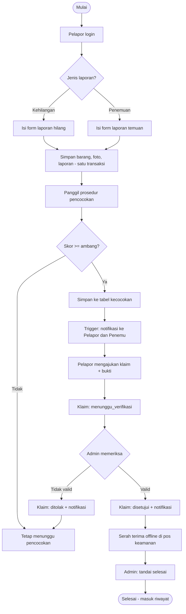
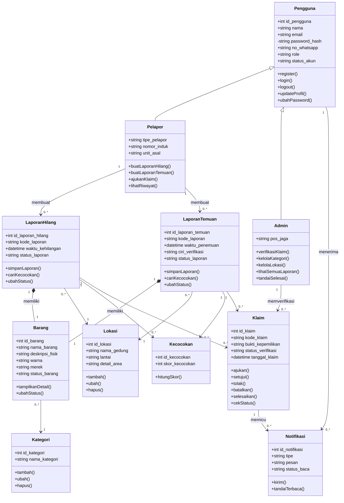
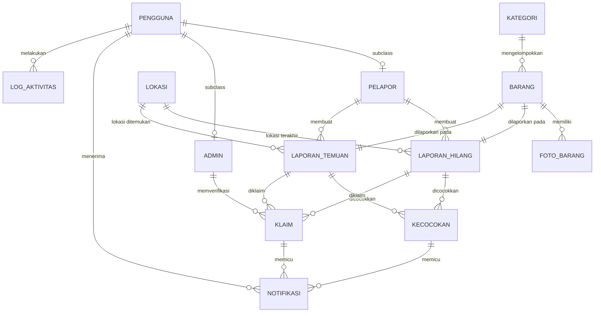

# PRD — Sistem Informasi Lost and Found Campus

> **Product Requirement Document (PRD)**
> Mata Kuliah: Basis Data (dengan pendekatan OOP)
> Versi: 1.0 (Draft Final) · Tanggal: 28 September 2026
> Status: Siap dijadikan acuan implementasi

---

## Daftar Isi

1. [Ringkasan Eksekutif](#1-ringkasan-eksekutif)
2. [Latar Belakang dan Masalah](#2-latar-belakang-dan-masalah)
3. [Tujuan, Sasaran, dan Metrik Keberhasilan](#3-tujuan-sasaran-dan-metrik-keberhasilan)
4. [Ruang Lingkup](#4-ruang-lingkup)
5. [Koreksi dan Penyesuaian terhadap Laporan Awal](#5-koreksi-dan-penyesuaian-terhadap-laporan-awal)
6. [Persona, Peran, dan Hak Akses](#6-persona-peran-dan-hak-akses)
7. [User Stories](#7-user-stories)
8. [Kebutuhan Fungsional (FR)](#8-kebutuhan-fungsional-fr)
9. [Alur Bisnis dan State Machine](#9-alur-bisnis-dan-state-machine)
10. [Algoritma Pencocokan Otomatis](#10-algoritma-pencocokan-otomatis)
11. [Kebutuhan Non-Fungsional (NFR)](#11-kebutuhan-non-fungsional-nfr)
12. [Arsitektur dan Tech Stack](#12-arsitektur-dan-tech-stack)
13. [Perancangan Class (OOP)](#13-perancangan-class-oop)
14. [Perancangan Basis Data](#14-perancangan-basis-data)
15. [Perancangan UI/UX](#15-perancangan-uiux)
16. [Routing dan Endpoint](#16-routing-dan-endpoint)
17. [Keamanan](#17-keamanan)
18. [Rencana Pengujian](#18-rencana-pengujian)
19. [Struktur Folder Proyek](#19-struktur-folder-proyek)
20. [Deployment dan Environment](#20-deployment-dan-environment)
21. [Rencana Kerja dan Pembagian Tugas](#21-rencana-kerja-dan-pembagian-tugas)
22. [Risiko dan Mitigasi](#22-risiko-dan-mitigasi)
23. [Checklist Deliverable Mata Kuliah](#23-checklist-deliverable-mata-kuliah)
24. [Definition of Done](#24-definition-of-done)
25. [Glosarium](#25-glosarium)
26. [Lampiran](#26-lampiran)

---

## 1. Ringkasan Eksekutif

**Lost and Found Campus** adalah aplikasi web terpusat bagi civitas akademika (mahasiswa, dosen, tenaga kependidikan) untuk **melaporkan, mencari, mencocokkan, dan mengklaim** barang yang hilang atau ditemukan di lingkungan kampus. Sistem menggantikan pencatatan manual yang tersebar di WhatsApp, Instagram, dan mading.

**Nilai utama produk:**

| Nilai | Penjelasan |
|---|---|
| Terpusat | Semua laporan hilang dan temuan ada dalam satu basis data relasional |
| Otomatis | Sistem mencocokkan laporan hilang dengan laporan temuan (matching query) berbasis skor |
| Aman | Klaim wajib disertai bukti kepemilikan dan diverifikasi Admin untuk mencegah klaim palsu |
| Transparan | Status laporan dan klaim dapat dipantau; ada notifikasi otomatis |
| Terdokumentasi | Riwayat laporan, klaim, dan verifikasi tersimpan sistematis |

**Batas penting:** serah terima fisik barang tetap **offline** di pos keamanan/pusat layanan. Sistem hanya mencatat data dan memvalidasi status.

**Fokus mata kuliah Basis Data:** rancangan ERD, normalisasi hingga 3NF, DDL dengan constraint integritas, index, view, stored procedure, trigger, transaksi, serta query CRUD/JOIN/agregasi. Semua itu diperlakukan sebagai kebutuhan utama, bukan pelengkap.

---

## 2. Latar Belakang dan Masalah

Kehilangan barang di kampus sulit ditangani karena pelaporan manual dan tersebar. Informasi mudah tertimbun unggahan lain dan tidak bisa dipantau pihak kampus maupun pemilik barang.

### 2.1 Identifikasi Masalah

| ID | Masalah | Dampak |
|---|---|---|
| P1 | Informasi tersebar di banyak platform | Sulit dipantau terpusat |
| P2 | Pencocokan hilang dan temuan dilakukan manual | Lama dan tidak konsisten |
| P3 | Tidak ada dokumentasi/riwayat sistematis | Tidak ada data historis |
| P4 | Klaim minim validasi | Berpotensi klaim palsu |
| P5 | Petugas sulit memantau seluruh data | Pengelolaan tidak efisien |
| P6 | Tidak ada notifikasi ke pemilik | Barang telat diketahui ditemukan |

### 2.2 Pemetaan Masalah ke Solusi

| Masalah | Fitur Solusi | FR terkait |
|---|---|---|
| P1 | Dashboard publik terpusat, pencarian, filter | FR-LAP-*, FR-CARI-* |
| P2 | Matching otomatis berbasis skor | FR-MATCH-* |
| P3 | Riwayat laporan/klaim + log aktivitas | FR-RIW-*, FR-LOG-* |
| P4 | Bukti kepemilikan, ciri rahasia, verifikasi Admin | FR-KLAIM-* |
| P5 | Panel Admin, statistik, kelola master data | FR-ADM-* |
| P6 | Notifikasi in-app otomatis (opsional email) | FR-NOTIF-* |

---

## 3. Tujuan, Sasaran, dan Metrik Keberhasilan

### 3.1 Tujuan Umum
Merancang dan membangun basis data relasional serta sistem informasi Lost and Found Campus yang mengintegrasikan pencatatan barang hilang dan ditemukan secara terpusat.

### 3.2 Tujuan Khusus
1. Menyediakan sistem terpusat untuk menyimpan dan mengelola laporan barang hilang/temuan.
2. Memudahkan mahasiswa, dosen, dan tendik membuat laporan.
3. Mempermudah pencarian dan pencocokan laporan.
4. Meningkatkan ketertiban dan keamanan pengelolaan barang.
5. Mengurangi risiko salah catat dengan basis data terstruktur.

### 3.3 Metrik Keberhasilan (Success Metrics)

| Metrik | Target | Cara Ukur |
|---|---|---|
| Waktu membuat laporan | ≤ 2 menit | Uji usability dengan 5 responden |
| Pencocokan otomatis berjalan | ≤ 3 detik setelah laporan disimpan | Uji fungsional + log |
| Akurasi saran kecocokan (top-3) | ≥ 70% pada data uji | Dataset uji 30 pasangan |
| Integritas data | 0 orphan record, 0 klaim ganda | Query audit integritas |
| Halaman utama memuat | ≤ 2 detik (data 1.000 laporan) | Browser DevTools/Lighthouse |
| Cakupan uji fungsional | 100% FR prioritas Must lulus | Matriks uji (bagian 18) |
| Skor Lighthouse | Performance ≥ 80, Accessibility ≥ 85 | Lighthouse |

---

## 4. Ruang Lingkup

### 4.1 In Scope

- Registrasi, login, logout, profil pengguna
- Pembuatan, ubah, hapus (soft delete) laporan kehilangan dan penemuan, termasuk unggah foto
- Pencarian dan filter laporan publik
- Pencocokan otomatis dan daftar saran kecocokan
- Pengajuan klaim beserta bukti, verifikasi Admin (setujui/tolak), penutupan (selesai)
- Notifikasi in-app otomatis
- Panel Admin: kelola kategori, lokasi, pengguna, laporan, klaim, statistik
- Riwayat dan log aktivitas
- Operasi CRUD lengkap, matching query, dan pembaruan status klaim

### 4.2 Out of Scope

| Item | Alasan |
|---|---|
| Transaksi keuangan/imbalan | Batasan masalah laporan |
| Pelacakan GPS real-time | Batasan masalah laporan |
| Serah terima fisik online | Tetap offline di pos keamanan |
| Aplikasi mobile native | Cukup web responsif |
| Integrasi SSO kampus | Dapat dikembangkan kemudian (future work) |
| Pencocokan foto berbasis AI/computer vision | Future work |
| Chat antar pengguna | Kontak melalui WhatsApp yang tercatat, dikendalikan ketat (lihat FR-PRIV) |

### 4.3 Asumsi

1. Pengguna memiliki email aktif. Domain email dapat dibatasi lewat konfigurasi (`ALLOWED_EMAIL_DOMAINS`), misalnya domain kampus.
2. Akun Admin/Petugas dibuat oleh seeder atau oleh Admin lain, tidak lewat registrasi publik.
3. Aplikasi dijalankan di jaringan internet/intranet kampus dengan browser modern.
4. Satu laporan mencatat satu barang (1 laporan : 1 barang).
5. Zona waktu default: `Asia/Jakarta` (WIB).

---

## 5. Koreksi dan Penyesuaian terhadap Laporan Awal

PRD ini memperbaiki beberapa hal yang tidak konsisten pada laporan awal. Bagian ini perlu dijadikan acuan saat merevisi laporan.

| No | Temuan pada Laporan Awal | Koreksi pada PRD |
|---|---|---|
| K1 | Subclass **Mahasiswa** membatasi pengguna hanya mahasiswa, padahal tujuan mencakup dosen dan tendik | Diganti menjadi **Pelapor**. Atribut `nim` menjadi `nomor_induk` (NIM/NIP/NIK), `jurusan` menjadi `unit_asal` (prodi/fakultas/biro). Ditambah `tipe_pelapor` (mahasiswa/dosen/tendik) |
| K2 | Diagram kelas memuat **Pelapor** dan **Penemu** sebagai subclass terpisah, sementara tabel dan teks hanya memakai Mahasiswa dan Admin | **Penemu bukan subclass**. Pelapor otomatis berperan sebagai pelapor kehilangan **dan** penemu, tergantung jenis laporan yang dibuat. Subclass hanya dua: `Pelapor` dan `Admin` |
| K3 | Batasan masalah menyebut aktor "Mahasiswa" | Diubah menjadi "Pelapor (mahasiswa, dosen, tendik)" |
| K4 | Atribut Pengguna tidak konsisten (`noWhatsapp` vs `no_telepon`, `password` tidak tercantum di tabel atribut) | Distandarkan: `no_whatsapp`, `password_hash` |
| K5 | Alur menyebut sistem langsung membuat entri Klaim saat ada kecocokan, padahal fitur klaim mensyaratkan bukti kepemilikan dari Pelapor | Dipisah: kecocokan disimpan di tabel **`kecocokan`** (saran + skor). **Klaim** dibuat saat Pelapor mengajukan bukti. Trigger notifikasi tetap otomatis pada kedua peristiwa |
| K6 | Relasi *Composition* Barang↔Laporan dan *Aggregation* Klaim↔Barang membingungkan (klaim tidak langsung menunjuk barang) | Barang **composition** ke laporan (relasi 1:1 dengan `UNIQUE id_barang`, `ON DELETE CASCADE` pada arah laporan menghapus barang lewat aplikasi/trigger). Klaim menghubungkan `laporan_hilang` dan `laporan_temuan`, tidak langsung ke barang |
| K7 | Status tidak seragam ("Dicari", "Masih Dicari", "Menunggu Klaim", "Pending") | Distandarkan pada state machine di bagian 9 |
| K8 | Atribut `kategori` pada Barang bertipe String, sedangkan ada class Kategori terpisah | `barang.id_kategori` menjadi FK ke tabel `kategori` (memenuhi 3NF) |
| K9 | Lokasi memiliki `lantai` bertipe String tanpa constraint | Tetap VARCHAR (lantai bisa "G", "Basement"), dibatasi unique kombinasi gedung-lantai-detail |
| K10 | Notifikasi hanya menyebut perubahan status klaim | Ditambah tipe: kecocokan, status klaim, pengumuman admin |
| K11 | Laporan bertajuk Basis Data tetapi banyak bagian berbahasa OOP | PRD ini memuat DDL, trigger, SP, view, index, dan transaksi sebagai inti penilaian Basis Data, dipetakan juga ke class OOP |

---

## 6. Persona, Peran, dan Hak Akses

### 6.1 Persona

| Persona | Deskripsi | Kebutuhan Utama | Frustrasi Saat Ini |
|---|---|---|---|
| **Dina — Mahasiswa** | Mahasiswa semester 3, sering berpindah gedung | Lapor cepat, tahu kalau barangnya ketemu | Postingan grup WA tenggelam |
| **Pak Budi — Dosen** | Dosen, jarang buka media sosial kampus | Antarmuka sederhana, notifikasi jelas | Tidak tahu harus lapor ke siapa |
| **Rina — Tendik/Staf** | Staf akademik yang sering menemukan barang tertinggal | Mudah melaporkan barang temuan | Barang menumpuk di meja tanpa pemilik |
| **Andi — Petugas Keamanan (Admin)** | Bertugas di pos jaga | Verifikasi klaim, cek data menyeluruh | Catatan manual di buku |

### 6.2 Peran Sistem

| Peran | Cara Mendapatkan Akun | Keterangan |
|---|---|---|
| Tamu (Guest) | Tanpa akun | Boleh melihat dashboard publik dan mencari; tidak melihat kontak maupun detail sensitif |
| Pelapor | Registrasi mandiri | Mahasiswa/dosen/tendik; melapor hilang dan temuan, klaim |
| Admin | Dibuat seeder/Admin | Verifikasi klaim, kelola master, pantau semua data |

### 6.3 Matriks Hak Akses (RBAC)

| Aksi | Tamu | Pelapor | Admin |
|---|:-:|:-:|:-:|
| Lihat dashboard/daftar laporan publik | ✔ | ✔ | ✔ |
| Cari dan filter laporan | ✔ | ✔ | ✔ |
| Lihat detail laporan (versi publik) | ✔ | ✔ | ✔ |
| Lihat kontak pelapor/penemu | ✘ | Hanya pihak terkait klaim yang disetujui | ✔ |
| Registrasi/login | ✔ | — | — |
| Buat laporan hilang/temuan | ✘ | ✔ | ✔ (atas nama pengguna, opsional) |
| Ubah/hapus laporan milik sendiri | ✘ | ✔ (selama belum masuk proses klaim) | ✔ (semua) |
| Lihat saran kecocokan laporan milik sendiri | ✘ | ✔ | ✔ (semua) |
| Ajukan klaim | ✘ | ✔ (hanya untuk laporan hilang miliknya) | ✘ |
| Verifikasi (setujui/tolak) klaim | ✘ | ✘ | ✔ |
| Tandai serah terima selesai | ✘ | ✘ | ✔ |
| Kelola kategori dan lokasi | ✘ | ✘ | ✔ |
| Kelola pengguna (aktif/nonaktif) | ✘ | ✘ | ✔ |
| Lihat statistik dan log aktivitas | ✘ | ✘ | ✔ |
| Baca notifikasi sendiri | ✘ | ✔ | ✔ |

---

## 7. User Stories

Prioritas memakai MoSCoW: **M** (Must), **S** (Should), **C** (Could), **W** (Won't kali ini).

| ID | Sebagai | Saya ingin | Agar | Prioritas |
|---|---|---|---|:-:|
| US-01 | Calon pengguna | Mendaftar akun dengan data diri dan nomor induk | Dapat memakai sistem | M |
| US-02 | Pengguna | Login dan logout dengan aman | Data saya terlindungi | M |
| US-03 | Pengguna | Mengubah profil dan kata sandi | Data saya selalu benar | S |
| US-04 | Pelapor | Membuat laporan kehilangan dengan detail dan foto | Orang lain tahu barang saya hilang | M |
| US-05 | Pelapor (penemu) | Membuat laporan penemuan dengan foto dan lokasi | Pemilik dapat menemukan barangnya | M |
| US-06 | Pengguna | Melihat daftar laporan dengan pencarian dan filter | Cepat menemukan laporan relevan | M |
| US-07 | Pelapor | Mengubah atau menghapus laporan saya | Data tetap akurat | M |
| US-08 | Pelapor | Menerima saran kecocokan otomatis | Tidak perlu mencari manual | M |
| US-09 | Pelapor | Mengajukan klaim dengan bukti kepemilikan | Dapat mengambil barang saya | M |
| US-10 | Admin | Melihat antrean klaim menunggu verifikasi | Memproses klaim berurutan | M |
| US-11 | Admin | Menyetujui atau menolak klaim beserta catatan | Mencegah klaim palsu | M |
| US-12 | Admin | Menandai serah terima selesai | Riwayat lengkap | M |
| US-13 | Pengguna | Menerima notifikasi kecocokan/perubahan status | Selalu tahu perkembangan | M |
| US-14 | Admin | Mengelola kategori dan lokasi | Data master selalu relevan | M |
| US-15 | Admin | Melihat statistik dashboard | Memantau kinerja layanan | S |
| US-16 | Pelapor | Melihat riwayat laporan dan klaim saya | Mengecek status kapan saja | M |
| US-17 | Admin | Menonaktifkan pengguna bermasalah | Menjaga kualitas sistem | S |
| US-18 | Admin | Melihat log aktivitas | Audit dan akuntabilitas | S |
| US-19 | Pengguna | Menggunakan sistem dari ponsel | Praktis di area kampus | M |
| US-20 | Admin | Mengekspor laporan ke CSV | Rekap untuk pihak kampus | C |
| US-21 | Pelapor | Menerima email saat ada kecocokan | Tidak ketinggalan info | C |
| US-22 | Pengguna | Lupa kata sandi dan mereset lewat email | Dapat masuk kembali | S |
| US-23 | Admin | Menerima laporan otomatis yang kedaluwarsa | Barang lama dapat ditangani (dilelang/disumbang sesuai kebijakan kampus) | C |

---

## 8. Kebutuhan Fungsional (FR)

Format: **ID — Deskripsi**. **AC** = *Acceptance Criteria* yang dapat diuji.

### 8.1 Modul Autentikasi dan Akun (FR-AUTH)

**FR-AUTH-01 — Registrasi Pelapor** (M)
- Field: nama lengkap, email, no. WhatsApp, tipe pelapor (mahasiswa/dosen/tendik), nomor induk (NIM/NIP/NIK), unit asal, kata sandi, konfirmasi kata sandi.
- AC:
  1. Email unik; duplikat ditolak dengan pesan jelas.
  2. Nomor induk unik.
  3. Kata sandi minimal 8 karakter, memuat huruf dan angka.
  4. No. WhatsApp berformat Indonesia (`08xx`/`+628xx`), dinormalisasi ke `628xx`.
  5. Data tersimpan atomik: baris `pengguna` dan `pelapor` dibuat dalam satu transaksi. Jika salah satu gagal, keduanya dibatalkan.
  6. Role otomatis `pelapor`. Field role tidak boleh dikirim dari form (mass-assignment dilindungi).
  7. Kata sandi disimpan dalam bentuk hash (bcrypt/argon2), tidak pernah plaintext.

**FR-AUTH-02 — Login** (M)
- AC: login dengan email dan kata sandi; pesan error generik ("Email atau kata sandi salah"); akun `nonaktif` ditolak; pembatasan percobaan (5 kali gagal per 1 menit per IP+email); sesi regenerasi setelah login.

**FR-AUTH-03 — Logout** (M): sesi dihancurkan dan token CSRF diganti.

**FR-AUTH-04 — Ubah Profil** (S): nama, no. WhatsApp, unit asal dapat diubah; email dan nomor induk hanya dapat diubah Admin.

**FR-AUTH-05 — Ubah Kata Sandi** (S): wajib mengisi kata sandi lama.

**FR-AUTH-06 — Reset Kata Sandi via Email** (S): token sekali pakai, kedaluwarsa 60 menit.

**FR-AUTH-07 — Verifikasi Email** (C): akun belum terverifikasi tidak dapat mengajukan klaim.

### 8.2 Modul Laporan Kehilangan (FR-LAP-H)

**FR-LAP-H-01 — Buat Laporan Kehilangan** (M)
- Field: nama barang, kategori (dropdown dari master), deskripsi fisik, warna, merek, foto (0–3), waktu perkiraan hilang, lokasi terakhir terlihat (dropdown dari master), catatan tambahan.
- AC:
  1. Waktu kehilangan tidak boleh di masa depan.
  2. Foto: jpg/png/webp, maksimum 2 MB per file, maksimum 3 file.
  3. Sistem membuat baris `barang`, `foto_barang`, dan `laporan_hilang` dalam **satu transaksi**.
  4. Kode laporan otomatis berformat `LH-YYYYMMDD-XXXX`.
  5. Status awal `menunggu_pencocokan`.
  6. Setelah commit, sistem memanggil prosedur pencocokan (FR-MATCH-01).
  7. Pengguna diarahkan ke detail laporan dengan pesan sukses.

**FR-LAP-H-02 — Lihat Detail Laporan Kehilangan** (M): tampil nama, kategori, ciri, foto, lokasi, waktu, status, dan pelapor (nama saja, tanpa kontak).

**FR-LAP-H-03 — Ubah Laporan Kehilangan** (M): hanya pemilik laporan, dan hanya bila status `menunggu_pencocokan`. Jika sudah berstatus `menunggu_verifikasi`, perubahan dikunci (Admin tetap bisa mengubah).

**FR-LAP-H-04 — Hapus/Batalkan Laporan** (M): *soft delete* (`deleted_at`). Laporan yang sedang dalam klaim tidak dapat dihapus. Pembatalan mengubah status menjadi `dibatalkan`.

### 8.3 Modul Laporan Penemuan (FR-LAP-T)

**FR-LAP-T-01 — Buat Laporan Penemuan** (M)
- Field: nama barang, kategori, deskripsi fisik (publik), **ciri verifikasi rahasia** (opsional, hanya terlihat oleh penemu dan Admin; dipakai Admin untuk menguji klaim), warna, merek, foto (1–3, foto wajib), waktu ditemukan, lokasi ditemukan, kondisi barang, status penyimpanan (dibawa penemu / dititipkan di pos).
- AC: sama dengan FR-LAP-H-01 dengan kode `LT-YYYYMMDD-XXXX`; foto **wajib minimal 1**; bila "dititipkan di pos", Admin ditandai untuk menerima fisik barang.

**FR-LAP-T-02 s.d. T-04** — Detail, ubah, hapus/batalkan: perilaku sama dengan modul laporan kehilangan.

**FR-LAP-T-05 — Penitipan ke Pos** (M): Admin dapat menandai bahwa barang fisik telah diterima di pos (`diterima_di_pos_pada`) dan mencatat petugas penerima.

### 8.4 Modul Pencarian dan Dashboard (FR-CARI)

**FR-CARI-01 — Dashboard Publik** (M): dua tab/kolom, "Barang Hilang" dan "Barang Ditemukan", urutan terbaru, paginasi 12 item/halaman, kartu berisi foto, nama, kategori, lokasi, tanggal, badge status.

**FR-CARI-02 — Pencarian** (M): kata kunci pada nama barang dan deskripsi (FULLTEXT + fallback LIKE).

**FR-CARI-03 — Filter** (M): kategori, lokasi/gedung, rentang tanggal, status. Kombinasi filter bersifat AND.

**FR-CARI-04 — Pengurutan** (S): terbaru, terlama.

**FR-CARI-05 — Hanya Tampilkan Laporan Aktif** (M): laporan `selesai`/`dibatalkan`/soft-deleted tidak muncul di dashboard publik (tetap ada di riwayat pemilik dan Admin).

### 8.5 Modul Pencocokan Otomatis (FR-MATCH)

**FR-MATCH-01 — Jalankan Pencocokan Otomatis** (M)
- Dipicu setelah laporan hilang atau temuan tersimpan.
- Membandingkan kategori, lokasi, rentang waktu, dan kemiripan teks (bagian 10).
- Pasangan dengan skor ≥ ambang (default 50) disimpan pada tabel `kecocokan`.
- AC: tidak ada duplikat pasangan (unique composite); proses idempotent; waktu eksekusi ≤ 3 detik pada 5.000 laporan aktif.

**FR-MATCH-02 — Tampilkan Saran Kecocokan** (M): pada halaman detail laporan milik sendiri, tampil daftar saran diurutkan skor terbesar, lengkap dengan alasan kecocokan (kategori sama, gedung sama, selisih waktu).

**FR-MATCH-03 — Notifikasi Kecocokan** (M): setiap baris baru `kecocokan` memicu notifikasi ke pelapor hilang dan penemu (trigger).

**FR-MATCH-04 — Pencocokan Ulang** (S): perintah terjadwal (`schedule:run` harian) dan tombol Admin untuk menjalankan ulang pencocokan bagi laporan yang masih `menunggu_pencocokan`.

**FR-MATCH-05 — Tolak Saran** (C): Pelapor dapat menyembunyikan saran yang tidak relevan.

### 8.6 Modul Klaim dan Verifikasi (FR-KLAIM)

**FR-KLAIM-01 — Ajukan Klaim** (M)
- Pelapor hilang memilih satu saran kecocokan (atau pasangan laporan yang relevan) lalu mengisi **bukti kepemilikan**: uraian ciri yang hanya diketahui pemilik (mis. isi dompet, goresan, wallpaper, nomor seri) dan/atau foto bukti (foto lama, nota/dus, tangkapan layar).
- AC:
  1. Hanya pemilik `laporan_hilang` yang boleh mengajukan.
  2. Pasangan (laporan_hilang, laporan_temuan) unik. Klaim ganda ditolak oleh `UNIQUE` di basis data dan validasi aplikasi.
  3. Kedua laporan harus aktif dan belum `selesai`.
  4. Uraian bukti minimal 30 karakter.
  5. Status awal klaim `menunggu_verifikasi`; status kedua laporan menjadi `menunggu_verifikasi`; status barang menjadi `dalam_proses_klaim`.
  6. Seluruh perubahan status di atas dijalankan dalam **satu transaksi**.

**FR-KLAIM-02 — Antrean Verifikasi Admin** (M): daftar klaim `menunggu_verifikasi` diurutkan dari yang tertua, dengan filter status dan pencarian kode klaim.

**FR-KLAIM-03 — Detail Klaim untuk Admin** (M): tampil perbandingan berdampingan antara laporan hilang (ciri dan bukti pemilik) dengan laporan temuan (deskripsi publik + ciri rahasia penemu), foto, kontak kedua pihak (khusus Admin).

**FR-KLAIM-04 — Setujui Klaim** (M)
- AC: Admin mengisi catatan (opsional); status klaim `disetujui`; `id_admin_verifikator` dan `tanggal_verifikasi` terisi; notifikasi ke Pelapor berisi instruksi mengambil barang di pos keamanan beserta kode klaim; penemu juga diberi tahu.

**FR-KLAIM-05 — Tolak Klaim** (M)
- AC: **catatan alasan wajib**; status klaim `ditolak`; kedua laporan kembali ke `menunggu_pencocokan`; barang kembali ke status semula (`hilang`/`ditemukan`); notifikasi penolakan ke Pelapor.

**FR-KLAIM-06 — Tandai Selesai (Serah Terima)** (M)
- AC: hanya dari status `disetujui`; Admin mencatat waktu dan nama penerima barang; status klaim `selesai`; kedua laporan `selesai`; barang `selesai`; laporan tampil di riwayat, hilang dari dashboard publik.

**FR-KLAIM-07 — Batas Waktu Pengambilan** (C): klaim `disetujui` yang tidak diambil dalam 7 hari mengirim pengingat; dalam 30 hari Admin ditandai untuk menindaklanjuti.

**FR-KLAIM-08 — Pembatasan Klaim Berulang** (S): Pelapor yang ditolak 3 kali dalam 30 hari ditandai untuk ditinjau Admin.

### 8.7 Modul Notifikasi (FR-NOTIF)

**FR-NOTIF-01 — Pembuatan Otomatis** (M): notifikasi dibuat oleh trigger basis data pada peristiwa berikut.

| Peristiwa | Penerima | Tipe |
|---|---|---|
| Kecocokan baru | Pelapor hilang dan penemu | `kecocokan` |
| Klaim diajukan | Pelapor + semua Admin (opsional) | `status_klaim` |
| Klaim disetujui | Pelapor dan penemu | `status_klaim` |
| Klaim ditolak | Pelapor | `status_klaim` |
| Klaim selesai | Pelapor dan penemu | `status_klaim` |
| Pengumuman | Semua/sebagian pengguna | `pengumuman` |

**FR-NOTIF-02 — Daftar Notifikasi** (M): halaman notifikasi dengan badge jumlah "belum dibaca" di navbar.

**FR-NOTIF-03 — Tandai Dibaca** (M): satuan atau "tandai semua dibaca". Klik notifikasi mengarahkan ke halaman terkait.

**FR-NOTIF-04 — Notifikasi Email** (C): queue mengirim email untuk tipe `kecocokan` dan `status_klaim`.

**FR-NOTIF-05 — Retensi** (C): notifikasi sudah dibaca lebih dari 90 hari dihapus oleh scheduler.

### 8.8 Modul Admin (FR-ADM)

**FR-ADM-01 — Kelola Kategori** (M): tambah, ubah, hapus. Nama unik. Kategori yang masih dipakai barang **tidak dapat dihapus** (`ON DELETE RESTRICT`), tampilkan pesan yang jelas; alternatifnya dinonaktifkan.

**FR-ADM-02 — Kelola Lokasi** (M): tambah, ubah, hapus dengan aturan sama seperti kategori.

**FR-ADM-03 — Kelola Pengguna** (S): daftar, cari, aktifkan/nonaktifkan, reset kata sandi paksa. Admin tidak dapat menonaktifkan dirinya sendiri.

**FR-ADM-04 — Lihat Semua Laporan** (M): seluruh laporan hilang dan temuan termasuk yang selesai/dibatalkan, dengan filter lengkap.

**FR-ADM-05 — Statistik Dashboard** (S): total laporan hilang, temuan, klaim menunggu verifikasi, barang berhasil dikembalikan (persentase), grafik laporan per bulan, kategori terbanyak, lokasi paling rawan (Top 5).

**FR-ADM-06 — Ekspor CSV** (C): laporan dan klaim berdasarkan rentang tanggal.

**FR-ADM-07 — Kelola Admin** (S): Admin dapat menambah Admin baru (nama, email, pos jaga).

### 8.9 Modul Riwayat dan Log (FR-RIW / FR-LOG)

**FR-RIW-01 — Riwayat Pengguna** (M): halaman "Riwayat Saya" berisi seluruh laporan hilang, temuan, dan klaim dengan status dan tanggal.

**FR-LOG-01 — Log Aktivitas** (S): pencatatan aksi penting (login, buat/ubah/hapus laporan, klaim, verifikasi, ubah master) beserta pengguna, waktu, IP, dan ringkasan perubahan. Log tidak dapat diubah lewat UI.

### 8.10 Modul Privasi (FR-PRIV)

**FR-PRIV-01** (M): kontak (email dan WhatsApp) tidak pernah tampil ke publik. Kontak antar pihak dibuka **hanya** setelah klaim berstatus `disetujui` dan hanya kepada pihak yang terkait, atau selalu lewat Admin bila kebijakan kampus menghendaki.

**FR-PRIV-02** (M): `ciri_verifikasi` pada laporan temuan tidak boleh muncul pada API/halaman publik maupun halaman Pelapor lain.

**FR-PRIV-03** (S): foto yang memuat dokumen pribadi (KTP/KTM) sebaiknya di-blur oleh penemu; tampilkan pengingat pada form.

---

## 9. Alur Bisnis dan State Machine

### 9.1 Alur Umum End-to-End



### 9.2 State Machine Laporan (`laporan_hilang` dan `laporan_temuan`)

| Status | Arti | Transisi Sah |
|---|---|---|
| `menunggu_pencocokan` | Baru dibuat/belum ada klaim | → `menunggu_verifikasi`, → `dibatalkan` |
| `menunggu_verifikasi` | Ada klaim aktif | → `selesai`, → `menunggu_pencocokan` (klaim ditolak), → `dibatalkan` (hanya Admin) |
| `selesai` | Barang sudah diserahterimakan | (final) |
| `dibatalkan` | Dibatalkan pemilik/Admin | (final) |

### 9.3 State Machine Klaim

| Status | Arti | Aktor Pemicu | Transisi Sah |
|---|---|---|---|
| `menunggu_verifikasi` | Klaim diajukan | Pelapor | → `disetujui`, → `ditolak`, → `dibatalkan` (oleh Pelapor sebelum diproses) |
| `disetujui` | Bukti valid, menunggu pengambilan | Admin | → `selesai` |
| `ditolak` | Bukti tidak valid | Admin | (final; Pelapor boleh mengajukan klaim baru ke temuan **lain**; klaim ulang ke temuan yang sama diizinkan Admin) |
| `selesai` | Barang diserahkan | Admin | (final) |
| `dibatalkan` | Klaim ditarik Pelapor | Pelapor | (final) |

> Catatan: untuk klaim `ditolak`/`dibatalkan`, aturan `UNIQUE(id_laporan_hilang, id_laporan_temuan)` membuat klaim ulang pada pasangan yang sama ditolak oleh database. Bila kebijakan menghendaki pengajuan ulang, Admin **mengaktifkan kembali** baris klaim yang sama (mengubah status ke `menunggu_verifikasi`) alih-alih membuat baris baru.

### 9.4 State Machine Barang (`barang.status_barang`)

`hilang` / `ditemukan` → `dalam_proses_klaim` → `selesai`
(Jika klaim ditolak/dibatalkan, kembali ke `hilang`/`ditemukan`.)

Nilai `hilang` atau `ditemukan` ditentukan oleh jenis laporan yang memiliki barang tersebut.

### 9.5 Tabel Sinkronisasi Status (dijalankan dalam transaksi)

| Peristiwa | laporan_hilang | laporan_temuan | klaim | barang (kedua) |
|---|---|---|---|---|
| Klaim diajukan | menunggu_verifikasi | menunggu_verifikasi | menunggu_verifikasi | dalam_proses_klaim |
| Klaim disetujui | menunggu_verifikasi | menunggu_verifikasi | disetujui | dalam_proses_klaim |
| Klaim ditolak/dibatalkan | menunggu_pencocokan | menunggu_pencocokan | ditolak/dibatalkan | hilang / ditemukan |
| Serah terima selesai | selesai | selesai | selesai | selesai |

---

## 10. Algoritma Pencocokan Otomatis

### 10.1 Prinsip
1. **Filter keras (wajib lolos):** kategori sama; laporan temuan tidak boleh lebih awal dari waktu kehilangan (`waktu_penemuan >= waktu_kehilangan`); kedua laporan masih `menunggu_pencocokan`; laporan aktif (bukan soft-deleted); bukan laporan milik pengguna yang sama.
2. **Skor lunak (0–100):**

| Komponen | Bobot | Aturan |
|---|:-:|---|
| Kategori sama | 40 | Selalu didapat karena filter keras |
| Gedung sama | 25 | `lokasi.nama_gedung` sama (lantai/area berbeda tetap dihitung) |
| Kedekatan waktu | 15 | ≤ 72 jam = 15; ≤ 168 jam (7 hari) = 8; lainnya = 0 |
| Kemiripan teks | 20 | `MATCH AGAINST` pada `nama_barang` + `deskripsi_fisik` (skor relevansi dinormalisasi, maksimum 20) |
| Bonus warna/merek | +5 (opsional, batas total 100) | Warna atau merek sama persis (case-insensitive) |

3. **Ambang:** skor ≥ 50 disimpan sebagai saran (`kecocokan`). Nilai ambang disimpan pada tabel `pengaturan` atau `.env` (`MATCH_THRESHOLD=50`).
4. **Batas jumlah:** simpan maksimum 10 saran teratas per laporan.
5. **Idempotent:** `INSERT IGNORE` pada unique `(id_laporan_hilang, id_laporan_temuan)`; pencocokan ulang memperbarui skor (`ON DUPLICATE KEY UPDATE`).

### 10.2 Pseudocode

```
function cariKecocokan(laporan):
    kandidat = ambil laporan lawan jenis yang lolos filter keras
    untuk setiap k pada kandidat:
        skor = 40
        jika gedung(laporan) == gedung(k): skor += 25
        selisih = |waktu(laporan) - waktu(k)| dalam jam
        jika selisih <= 72: skor += 15
        selain itu jika selisih <= 168: skor += 8
        skor += min(20, round(relevansiTeks(laporan, k) * 5))
        jika warna sama atau merek sama: skor += 5
        skor = min(skor, 100)
        jika skor >= AMBANG: simpanKecocokan(laporan, k, skor)
    kembalikan top-10 berdasarkan skor
```

### 10.3 Alasan Kecocokan (Explainability)
Setiap saran menampilkan chip alasan: "Kategori sama", "Gedung sama", "Selisih waktu 5 jam", "Kemiripan deskripsi tinggi". Alasan dihitung ulang di lapisan aplikasi (tidak perlu disimpan).

---

## 11. Kebutuhan Non-Fungsional (NFR)

| ID | Kategori | Kebutuhan |
|---|---|---|
| NFR-01 | Kinerja | Halaman dashboard ≤ 2 detik untuk 1.000 laporan; query pencarian memakai index; paginasi wajib |
| NFR-02 | Kinerja | Pencocokan ≤ 3 detik untuk 5.000 laporan aktif |
| NFR-03 | Keamanan | Hash kata sandi, CSRF, XSS escaping, prepared statement, rate limiting (bagian 17) |
| NFR-04 | Integritas Data | PK, FK, UNIQUE, CHECK, NOT NULL, transaksi ACID (InnoDB) |
| NFR-05 | Ketersediaan | Target 99% selama jam kerja kampus (proyek kuliah: best effort) |
| NFR-06 | Kegunaan | Responsif (mobile-first, minimal 360 px), label form jelas, pesan error bahasa Indonesia |
| NFR-07 | Aksesibilitas | Kontras WCAG AA, alt text pada foto, navigasi keyboard |
| NFR-08 | Kompatibilitas | Chrome, Firefox, Edge, Safari (2 versi terakhir) |
| NFR-09 | Pemeliharaan | Kode mengikuti PSR-12 (bila PHP), migrasi versi, seeder, README |
| NFR-10 | Skalabilitas | Struktur mendukung penambahan kanal notifikasi dan kategori tanpa perubahan skema |
| NFR-11 | Portabilitas | Berjalan di XAMPP/Laragon (lokal) dan VPS/hosting Linux |
| NFR-12 | Backup | Dump basis data terjadwal harian (`mysqldump`), retensi 7 hari |
| NFR-13 | Lokalisasi | Bahasa Indonesia; format tanggal `dd MMM yyyy HH:mm` WIB |
| NFR-14 | Privasi | Kontak pengguna tidak tampil publik; data minimal yang diperlukan |
| NFR-15 | Observabilitas | Log kesalahan aplikasi dan log aktivitas pengguna |
| NFR-16 | Unggah Berkas | Validasi MIME dan ekstensi; nama file diacak; disimpan di luar `public` atau melalui storage link; batas 2 MB/file |

---

## 12. Arsitektur dan Tech Stack

### 12.1 Stack yang Direkomendasikan

| Lapisan | Pilihan Utama | Alternatif (jika tim lebih menguasai) |
|---|---|---|
| DBMS | **MySQL 8.0** (InnoDB, utf8mb4) | MariaDB 10.6+ |
| Backend | **PHP 8.2+ dengan Laravel 11** | Spring Boot 3 (Java 17+), Django 5 (Python 3.11+) |
| Templating | Blade | Thymeleaf / Django Templates |
| Frontend | **Tailwind CSS + Alpine.js** (via Vite) | Bootstrap 5 |
| Auth | Laravel Breeze (disesuaikan) atau sendiri | Spring Security / Django auth |
| ORM | Eloquent (dengan raw SQL untuk trigger/SP/view) | JPA / Django ORM |
| Local Server | XAMPP atau Laragon | Docker Compose |
| Editor | Visual Studio Code | — |
| VCS | Git + GitHub | — |
| Desain | Draw.io/dbdiagram.io/MySQL Workbench untuk ERD | — |
| Uji API/Manual | Postman, browser | — |
| Uji Otomatis | PHPUnit / Pest | JUnit / pytest |

> Bagian implementasi berikutnya memakai **Laravel + MySQL** sebagai referensi. Konsep basis data (DDL, SP, trigger, view) tetap sama untuk stack lain.

### 12.2 Arsitektur Logis

```
┌────────────────────────────── Browser (Guest / Pelapor / Admin) ──────────────────────────────┐
│                       HTML + Tailwind + Alpine.js (responsif)                                 │
└───────────────────────────────────────────────┬───────────────────────────────────────────────┘
                                                │ HTTPS
┌───────────────────────────────────────────────▼───────────────────────────────────────────────┐
│ Laravel (MVC)                                                                                 │
│  Routes → Middleware (auth, role, throttle, CSRF) → Controller → FormRequest (validasi)      │
│                 → Service (logika bisnis, transaksi) → Model/Repository (Eloquent + raw SQL) │
│  Policy/Gate (otorisasi) · Jobs/Queue (email) · Scheduler (pencocokan ulang, retensi)        │
└───────────────────────────────────────────────┬───────────────────────────────────────────────┘
                                                │ PDO (prepared statements)
┌───────────────────────────────────────────────▼───────────────────────────────────────────────┐
│ MySQL 8: Tabel · Constraint · Index · View · Stored Procedure · Trigger · Event (opsional)   │
└───────────────────────────────────────────────────────────────────────────────────────────────┘
        File storage: storage/app/public/barang (foto), storage/app/private/bukti (bukti klaim)
```

### 12.3 Pembagian Tanggung Jawab Logika

| Logika | Ditempatkan Di | Alasan |
|---|---|---|
| Integritas data (FK, unique, check) | Basis data | Wajib benar di level data |
| Notifikasi otomatis akibat perubahan status klaim/kecocokan | **Trigger** basis data | Menjamin notifikasi selalu terbentuk, memenuhi tujuan materi Basis Data |
| Perhitungan skor pencocokan | **Stored procedure** | Dekat data, cepat, mudah diuji lewat SQL |
| Alur multi-langkah (buat laporan, ajukan klaim, verifikasi) | Service layer + **transaksi** | Mudah diuji dan dipelihara |
| Otorisasi dan validasi input | Aplikasi | Umpan balik ke pengguna |

---

## 13. Perancangan Class (OOP)

### 13.1 Diagram Kelas



### 13.2 Tabel Hubungan Antar Class

| No | Class A | Class B | Jenis | Multiplicity | Keterangan |
|---|---|---|---|---|---|
| 1 | Pengguna | Pelapor, Admin | Generalization | — | Pewarisan; `id_pengguna` = PK sekaligus FK pada subclass |
| 2 | Pelapor | LaporanHilang | Association | 1 — 0..* | Satu pelapor banyak laporan hilang |
| 3 | Pelapor | LaporanTemuan | Association | 1 — 0..* | Satu pelapor (sebagai penemu) banyak laporan temuan |
| 4 | LaporanHilang / LaporanTemuan | Barang | Composition | 1 — 1 | Barang tidak berdiri sendiri; dihapus bersama laporan |
| 5 | Barang | Kategori | Association | 0..* — 1 | Setiap barang punya satu kategori |
| 6 | LaporanHilang / LaporanTemuan | Lokasi | Association | 0..* — 1 | Setiap laporan menunjuk satu lokasi |
| 7 | LaporanHilang | LaporanTemuan | Association (many-to-many via `kecocokan` dan `klaim`) | 0..* — 0..* | Pencocokan dan klaim |
| 8 | Admin | Klaim | Association | 1 — 0..* | Admin memverifikasi klaim |
| 9 | Klaim | Notifikasi | Association | 1 — 0..* | Perubahan status klaim memicu notifikasi |
| 10 | Pengguna | Notifikasi | Association | 1 — 0..* | Notifikasi ditujukan ke pengguna |

### 13.3 Pemetaan Class → Implementasi Laravel

| Class Desain | Model Eloquent | Catatan |
|---|---|---|
| Pengguna | `App\Models\Pengguna` (extends `Authenticatable`) | Tabel `pengguna` |
| Pelapor | `App\Models\Pelapor` | Tabel `pelapor`, `belongsTo(Pengguna)`; helper `Pengguna::pelapor()` (hasOne) |
| Admin | `App\Models\Admin` | Tabel `admin`, hasOne dari Pengguna |
| Barang | `App\Models\Barang` | `belongsTo(Kategori)`, `hasMany(FotoBarang)` |
| Kategori | `App\Models\Kategori` | — |
| Lokasi | `App\Models\Lokasi` | — |
| LaporanHilang | `App\Models\LaporanHilang` | `belongsTo(Pelapor)`, `belongsTo(Barang)`, `belongsTo(Lokasi)`, `SoftDeletes` |
| LaporanTemuan | `App\Models\LaporanTemuan` | Sama |
| Kecocokan | `App\Models\Kecocokan` | Pivot khusus dengan atribut skor |
| Klaim | `App\Models\Klaim` | `belongsTo` kedua laporan dan Admin |
| Notifikasi | `App\Models\Notifikasi` | `belongsTo(Pengguna)` |

**Catatan pewarisan:** pola yang dipakai adalah *class-table inheritance* (satu tabel untuk superclass, satu tabel untuk tiap subclass, dihubungkan 1:1 lewat PK=FK). Model `Pelapor` dan `Admin` mengambil data umum melalui relasi ke `Pengguna` (atau accessor), sedangkan method perilaku ditempatkan di **Service class** (mis. `LaporanService::buatLaporanHilang(Pelapor $p, array $data)`) agar tetap mudah diuji.

### 13.4 Service Class Utama

| Service | Method Inti |
|---|---|
| `AuthService` | `register()`, `login()`, `logout()` |
| `LaporanHilangService` | `buat()`, `ubah()`, `batalkan()`, `hapus()` |
| `LaporanTemuanService` | `buat()`, `ubah()`, `batalkan()`, `terimaDiPos()` |
| `KecocokanService` | `jalankanUntukHilang($id)`, `jalankanUntukTemuan($id)`, `jalankanUlangSemua()` |
| `KlaimService` | `ajukan()`, `setujui()`, `tolak()`, `batalkan()`, `selesaikan()` |
| `NotifikasiService` | `daftar()`, `tandaiDibaca()`, `tandaiSemuaDibaca()`, `hitungBelumDibaca()` |
| `MasterDataService` | `kategori()`, `lokasi()` (CRUD dengan cek dependensi) |
| `StatistikService` | `ringkasan()`, `perBulan()`, `kategoriTerbanyak()`, `lokasiRawan()` |
| `UploadService` | `simpanFoto()`, `hapusFoto()`, validasi MIME |

---

## 14. Perancangan Basis Data

### 14.1 ERD



> Catatan: hubungan BARANG–LAPORAN_HILANG dan BARANG–LAPORAN_TEMUAN masing-masing 1:1 (`UNIQUE id_barang` pada tabel laporan). Satu barang hanya dimiliki **salah satu** jenis laporan, aturan ini dijaga oleh aplikasi/trigger (bagian 14.7).

### 14.2 Kamus Data

#### Tabel `pengguna` (superclass)
| Kolom | Tipe | Constraint | Keterangan |
|---|---|---|---|
| id_pengguna | BIGINT UNSIGNED | PK, AUTO_INCREMENT | |
| nama | VARCHAR(100) | NOT NULL | Nama lengkap |
| email | VARCHAR(150) | NOT NULL, UNIQUE | Sarana login dan notifikasi |
| password_hash | VARCHAR(255) | NOT NULL | bcrypt/argon2 |
| no_whatsapp | VARCHAR(20) | NOT NULL | Format `628xxxxxxxxx` |
| role | ENUM('pelapor','admin') | NOT NULL | |
| status_akun | ENUM('aktif','nonaktif') | NOT NULL, DEFAULT 'aktif' | |
| email_verified_at | DATETIME | NULL | |
| remember_token | VARCHAR(100) | NULL | |
| created_at, updated_at | TIMESTAMP | | |

#### Tabel `pelapor` (subclass)
| Kolom | Tipe | Constraint | Keterangan |
|---|---|---|---|
| id_pengguna | BIGINT UNSIGNED | PK, FK → pengguna | PK sekaligus FK |
| tipe_pelapor | ENUM('mahasiswa','dosen','tendik') | NOT NULL | |
| nomor_induk | VARCHAR(30) | NOT NULL, UNIQUE | NIM / NIP / NIK |
| unit_asal | VARCHAR(150) | NOT NULL | Prodi / fakultas / biro / unit kerja |

#### Tabel `admin` (subclass)
| Kolom | Tipe | Constraint | Keterangan |
|---|---|---|---|
| id_pengguna | BIGINT UNSIGNED | PK, FK → pengguna | |
| pos_jaga | VARCHAR(100) | NOT NULL | Lokasi pos/unit bertugas |
| nip_petugas | VARCHAR(30) | NULL, UNIQUE | Opsional |

#### Tabel `kategori`
| Kolom | Tipe | Constraint |
|---|---|---|
| id_kategori | INT UNSIGNED | PK, AUTO_INCREMENT |
| nama_kategori | VARCHAR(60) | NOT NULL, UNIQUE |
| deskripsi | VARCHAR(255) | NULL |
| aktif | TINYINT(1) | NOT NULL, DEFAULT 1 |

#### Tabel `lokasi`
| Kolom | Tipe | Constraint |
|---|---|---|
| id_lokasi | INT UNSIGNED | PK, AUTO_INCREMENT |
| nama_gedung | VARCHAR(100) | NOT NULL |
| lantai | VARCHAR(10) | NOT NULL, DEFAULT '-' |
| detail_area | VARCHAR(150) | NOT NULL, DEFAULT '-' |
| aktif | TINYINT(1) | NOT NULL, DEFAULT 1 |
| — | — | UNIQUE (nama_gedung, lantai, detail_area) |

#### Tabel `barang`
| Kolom | Tipe | Constraint |
|---|---|---|
| id_barang | BIGINT UNSIGNED | PK, AUTO_INCREMENT |
| id_kategori | INT UNSIGNED | NOT NULL, FK → kategori (RESTRICT) |
| nama_barang | VARCHAR(120) | NOT NULL |
| deskripsi_fisik | TEXT | NOT NULL |
| warna | VARCHAR(40) | NULL |
| merek | VARCHAR(60) | NULL |
| status_barang | ENUM('hilang','ditemukan','dalam_proses_klaim','selesai') | NOT NULL |
| — | — | FULLTEXT (nama_barang, deskripsi_fisik) |

#### Tabel `foto_barang`
| Kolom | Tipe | Constraint |
|---|---|---|
| id_foto | BIGINT UNSIGNED | PK, AUTO_INCREMENT |
| id_barang | BIGINT UNSIGNED | NOT NULL, FK → barang (CASCADE) |
| path_file | VARCHAR(255) | NOT NULL |
| is_utama | TINYINT(1) | NOT NULL, DEFAULT 0 |
| urutan | TINYINT UNSIGNED | NOT NULL, DEFAULT 1 |

#### Tabel `laporan_hilang`
| Kolom | Tipe | Constraint |
|---|---|---|
| id_laporan_hilang | BIGINT UNSIGNED | PK, AUTO_INCREMENT |
| kode_laporan | VARCHAR(20) | NOT NULL, UNIQUE (`LH-YYYYMMDD-XXXX`) |
| id_pengguna | BIGINT UNSIGNED | NOT NULL, FK → pelapor |
| id_barang | BIGINT UNSIGNED | NOT NULL, UNIQUE, FK → barang |
| id_lokasi | INT UNSIGNED | NOT NULL, FK → lokasi |
| waktu_kehilangan | DATETIME | NOT NULL |
| tanggal_laporan | DATETIME | NOT NULL, DEFAULT CURRENT_TIMESTAMP |
| status_laporan | ENUM('menunggu_pencocokan','menunggu_verifikasi','selesai','dibatalkan') | NOT NULL, DEFAULT 'menunggu_pencocokan' |
| catatan | VARCHAR(255) | NULL |
| deleted_at | DATETIME | NULL (soft delete) |

#### Tabel `laporan_temuan`
Sama dengan `laporan_hilang`, ditambah/dengan perbedaan berikut.
| Kolom | Tipe | Keterangan |
|---|---|---|
| id_laporan_temuan | BIGINT UNSIGNED | PK |
| kode_laporan | VARCHAR(20) | `LT-YYYYMMDD-XXXX` |
| waktu_penemuan | DATETIME | NOT NULL |
| kondisi_barang | VARCHAR(150) | NULL |
| ciri_verifikasi | TEXT | NULL, rahasia; hanya untuk penemu dan Admin |
| disimpan_di | ENUM('dibawa_penemu','pos_keamanan') | NOT NULL, DEFAULT 'dibawa_penemu' |
| diterima_di_pos_pada | DATETIME | NULL |
| id_admin_penerima | BIGINT UNSIGNED | NULL, FK → admin |

#### Tabel `kecocokan`
| Kolom | Tipe | Constraint |
|---|---|---|
| id_kecocokan | BIGINT UNSIGNED | PK, AUTO_INCREMENT |
| id_laporan_hilang | BIGINT UNSIGNED | NOT NULL, FK (CASCADE) |
| id_laporan_temuan | BIGINT UNSIGNED | NOT NULL, FK (CASCADE) |
| skor_kecocokan | TINYINT UNSIGNED | NOT NULL, CHECK 0–100 |
| dihitung_pada | DATETIME | NOT NULL, DEFAULT CURRENT_TIMESTAMP |
| — | — | UNIQUE (id_laporan_hilang, id_laporan_temuan) |

#### Tabel `klaim`
| Kolom | Tipe | Constraint |
|---|---|---|
| id_klaim | BIGINT UNSIGNED | PK, AUTO_INCREMENT |
| kode_klaim | VARCHAR(20) | NOT NULL, UNIQUE (`KL-YYYYMMDD-XXXX`) |
| id_laporan_hilang | BIGINT UNSIGNED | NOT NULL, FK (RESTRICT) |
| id_laporan_temuan | BIGINT UNSIGNED | NOT NULL, FK (RESTRICT) |
| bukti_kepemilikan | TEXT | NOT NULL |
| foto_bukti | VARCHAR(255) | NULL |
| tanggal_klaim | DATETIME | NOT NULL, DEFAULT CURRENT_TIMESTAMP |
| status_verifikasi | ENUM('menunggu_verifikasi','disetujui','ditolak','selesai','dibatalkan') | NOT NULL, DEFAULT 'menunggu_verifikasi' |
| id_admin_verifikator | BIGINT UNSIGNED | NULL, FK → admin |
| tanggal_verifikasi | DATETIME | NULL |
| catatan_admin | VARCHAR(255) | NULL |
| tanggal_selesai | DATETIME | NULL |
| nama_penerima_barang | VARCHAR(100) | NULL |
| — | — | UNIQUE (id_laporan_hilang, id_laporan_temuan) |

#### Tabel `notifikasi`
| Kolom | Tipe | Constraint |
|---|---|---|
| id_notifikasi | BIGINT UNSIGNED | PK, AUTO_INCREMENT |
| id_pengguna | BIGINT UNSIGNED | NOT NULL, FK → pengguna (CASCADE) |
| tipe | ENUM('kecocokan','status_klaim','pengumuman') | NOT NULL |
| pesan | VARCHAR(255) | NOT NULL |
| id_klaim | BIGINT UNSIGNED | NULL, FK → klaim (SET NULL) |
| id_kecocokan | BIGINT UNSIGNED | NULL, FK → kecocokan (SET NULL) |
| status_baca | ENUM('belum_dibaca','sudah_dibaca') | NOT NULL, DEFAULT 'belum_dibaca' |
| tanggal_kirim | DATETIME | NOT NULL, DEFAULT CURRENT_TIMESTAMP |

#### Tabel `log_aktivitas`
| Kolom | Tipe | Keterangan |
|---|---|---|
| id_log | BIGINT UNSIGNED | PK |
| id_pengguna | BIGINT UNSIGNED NULL | FK, SET NULL |
| aksi | VARCHAR(60) | Contoh: `klaim.setujui` |
| entitas | VARCHAR(40) | Nama tabel |
| id_entitas | BIGINT UNSIGNED NULL | |
| detail | JSON NULL | Ringkasan perubahan |
| ip_address | VARCHAR(45) | |
| dibuat_pada | DATETIME | DEFAULT CURRENT_TIMESTAMP |

### 14.3 Bukti Normalisasi (1NF → 3NF)

| Bentuk | Pemeriksaan | Hasil |
|---|---|---|
| **1NF** | Tidak ada atribut multi-nilai/berulang. Foto banyak dipindahkan ke `foto_barang`. Semua atribut atomik (lantai, gedung dipisah) | Terpenuhi |
| **2NF** | Semua tabel ber-PK tunggal (surrogate); tidak ada ketergantungan parsial. Pada `klaim`, candidate key (id_laporan_hilang, id_laporan_temuan) bergantung penuh pada kedua kolom | Terpenuhi |
| **3NF** | Tidak ada ketergantungan transitif: nama kategori tidak disalin ke `barang` (hanya `id_kategori`); data lokasi tidak disalin ke laporan; identitas pelapor pada klaim **diturunkan** dari `laporan_hilang.id_pengguna`, bukan disimpan ulang; superclass–subclass memisahkan atribut umum dan khusus | Terpenuhi |

Denormalisasi yang disengaja: `barang.status_barang` (diturunkan dari status laporan/klaim). Alasan: mempercepat filter dashboard. Konsistensinya dijaga oleh Service dan transaksi (tabel 9.5).

### 14.4 DDL Lengkap (MySQL 8)

Simpan sebagai `database/schema.sql` (atau terjemahkan ke migrasi Laravel).

```sql
-- =====================================================================
-- LOST AND FOUND CAMPUS - SCHEMA (MySQL 8.0, InnoDB, utf8mb4)
-- =====================================================================
DROP DATABASE IF EXISTS lost_found_campus;
CREATE DATABASE lost_found_campus
  CHARACTER SET utf8mb4 COLLATE utf8mb4_unicode_ci;
USE lost_found_campus;
SET time_zone = '+07:00';

-- ---------- SUPERCLASS: PENGGUNA ----------
CREATE TABLE pengguna (
  id_pengguna       BIGINT UNSIGNED NOT NULL AUTO_INCREMENT,
  nama              VARCHAR(100) NOT NULL,
  email             VARCHAR(150) NOT NULL,
  password_hash     VARCHAR(255) NOT NULL,
  no_whatsapp       VARCHAR(20)  NOT NULL,
  role              ENUM('pelapor','admin') NOT NULL,
  status_akun       ENUM('aktif','nonaktif') NOT NULL DEFAULT 'aktif',
  email_verified_at DATETIME NULL,
  remember_token    VARCHAR(100) NULL,
  created_at        TIMESTAMP NULL DEFAULT CURRENT_TIMESTAMP,
  updated_at        TIMESTAMP NULL DEFAULT CURRENT_TIMESTAMP ON UPDATE CURRENT_TIMESTAMP,
  PRIMARY KEY (id_pengguna),
  UNIQUE KEY uq_pengguna_email (email),
  CONSTRAINT chk_pengguna_wa CHECK (no_whatsapp REGEXP '^62[0-9]{8,13}$')
) ENGINE=InnoDB;

-- ---------- SUBCLASS: PELAPOR (pengganti Mahasiswa) ----------
CREATE TABLE pelapor (
  id_pengguna   BIGINT UNSIGNED NOT NULL,
  tipe_pelapor  ENUM('mahasiswa','dosen','tendik') NOT NULL,
  nomor_induk   VARCHAR(30)  NOT NULL,   -- NIM / NIP / NIK
  unit_asal     VARCHAR(150) NOT NULL,   -- prodi / fakultas / biro / unit kerja
  PRIMARY KEY (id_pengguna),
  UNIQUE KEY uq_pelapor_nomor_induk (nomor_induk),
  CONSTRAINT fk_pelapor_pengguna FOREIGN KEY (id_pengguna)
    REFERENCES pengguna (id_pengguna) ON DELETE CASCADE ON UPDATE CASCADE
) ENGINE=InnoDB;

-- ---------- SUBCLASS: ADMIN ----------
CREATE TABLE admin (
  id_pengguna  BIGINT UNSIGNED NOT NULL,
  pos_jaga     VARCHAR(100) NOT NULL,
  nip_petugas  VARCHAR(30) NULL,
  PRIMARY KEY (id_pengguna),
  UNIQUE KEY uq_admin_nip (nip_petugas),
  CONSTRAINT fk_admin_pengguna FOREIGN KEY (id_pengguna)
    REFERENCES pengguna (id_pengguna) ON DELETE CASCADE ON UPDATE CASCADE
) ENGINE=InnoDB;

-- ---------- MASTER ----------
CREATE TABLE kategori (
  id_kategori    INT UNSIGNED NOT NULL AUTO_INCREMENT,
  nama_kategori  VARCHAR(60)  NOT NULL,
  deskripsi      VARCHAR(255) NULL,
  aktif          TINYINT(1)   NOT NULL DEFAULT 1,
  PRIMARY KEY (id_kategori),
  UNIQUE KEY uq_kategori_nama (nama_kategori)
) ENGINE=InnoDB;

CREATE TABLE lokasi (
  id_lokasi    INT UNSIGNED NOT NULL AUTO_INCREMENT,
  nama_gedung  VARCHAR(100) NOT NULL,
  lantai       VARCHAR(10)  NOT NULL DEFAULT '-',
  detail_area  VARCHAR(150) NOT NULL DEFAULT '-',
  aktif        TINYINT(1)   NOT NULL DEFAULT 1,
  PRIMARY KEY (id_lokasi),
  UNIQUE KEY uq_lokasi (nama_gedung, lantai, detail_area)
) ENGINE=InnoDB;

-- ---------- BARANG & FOTO ----------
CREATE TABLE barang (
  id_barang        BIGINT UNSIGNED NOT NULL AUTO_INCREMENT,
  id_kategori      INT UNSIGNED NOT NULL,
  nama_barang      VARCHAR(120) NOT NULL,
  deskripsi_fisik  TEXT NOT NULL,
  warna            VARCHAR(40) NULL,
  merek            VARCHAR(60) NULL,
  status_barang    ENUM('hilang','ditemukan','dalam_proses_klaim','selesai') NOT NULL,
  created_at       TIMESTAMP NULL DEFAULT CURRENT_TIMESTAMP,
  PRIMARY KEY (id_barang),
  KEY idx_barang_kategori (id_kategori),
  KEY idx_barang_status (status_barang),
  FULLTEXT KEY ft_barang_teks (nama_barang, deskripsi_fisik),
  CONSTRAINT fk_barang_kategori FOREIGN KEY (id_kategori)
    REFERENCES kategori (id_kategori) ON DELETE RESTRICT ON UPDATE CASCADE
) ENGINE=InnoDB;

CREATE TABLE foto_barang (
  id_foto    BIGINT UNSIGNED NOT NULL AUTO_INCREMENT,
  id_barang  BIGINT UNSIGNED NOT NULL,
  path_file  VARCHAR(255) NOT NULL,
  is_utama   TINYINT(1) NOT NULL DEFAULT 0,
  urutan     TINYINT UNSIGNED NOT NULL DEFAULT 1,
  PRIMARY KEY (id_foto),
  KEY idx_foto_barang (id_barang),
  CONSTRAINT fk_foto_barang FOREIGN KEY (id_barang)
    REFERENCES barang (id_barang) ON DELETE CASCADE ON UPDATE CASCADE
) ENGINE=InnoDB;

-- ---------- LAPORAN HILANG ----------
CREATE TABLE laporan_hilang (
  id_laporan_hilang BIGINT UNSIGNED NOT NULL AUTO_INCREMENT,
  kode_laporan      VARCHAR(20) NOT NULL,
  id_pengguna       BIGINT UNSIGNED NOT NULL,
  id_barang         BIGINT UNSIGNED NOT NULL,
  id_lokasi         INT UNSIGNED NOT NULL,
  waktu_kehilangan  DATETIME NOT NULL,
  tanggal_laporan   DATETIME NOT NULL DEFAULT CURRENT_TIMESTAMP,
  status_laporan    ENUM('menunggu_pencocokan','menunggu_verifikasi','selesai','dibatalkan')
                    NOT NULL DEFAULT 'menunggu_pencocokan',
  catatan           VARCHAR(255) NULL,
  deleted_at        DATETIME NULL,
  PRIMARY KEY (id_laporan_hilang),
  UNIQUE KEY uq_lh_kode (kode_laporan),
  UNIQUE KEY uq_lh_barang (id_barang),
  KEY idx_lh_pengguna (id_pengguna),
  KEY idx_lh_lokasi (id_lokasi),
  KEY idx_lh_status_waktu (status_laporan, waktu_kehilangan),
  CONSTRAINT fk_lh_pelapor FOREIGN KEY (id_pengguna)
    REFERENCES pelapor (id_pengguna) ON DELETE RESTRICT ON UPDATE CASCADE,
  CONSTRAINT fk_lh_barang FOREIGN KEY (id_barang)
    REFERENCES barang (id_barang) ON DELETE RESTRICT ON UPDATE CASCADE,
  CONSTRAINT fk_lh_lokasi FOREIGN KEY (id_lokasi)
    REFERENCES lokasi (id_lokasi) ON DELETE RESTRICT ON UPDATE CASCADE
) ENGINE=InnoDB;

-- ---------- LAPORAN TEMUAN ----------
CREATE TABLE laporan_temuan (
  id_laporan_temuan    BIGINT UNSIGNED NOT NULL AUTO_INCREMENT,
  kode_laporan         VARCHAR(20) NOT NULL,
  id_pengguna          BIGINT UNSIGNED NOT NULL,
  id_barang            BIGINT UNSIGNED NOT NULL,
  id_lokasi            INT UNSIGNED NOT NULL,
  waktu_penemuan       DATETIME NOT NULL,
  tanggal_laporan      DATETIME NOT NULL DEFAULT CURRENT_TIMESTAMP,
  kondisi_barang       VARCHAR(150) NULL,
  ciri_verifikasi      TEXT NULL,
  disimpan_di          ENUM('dibawa_penemu','pos_keamanan') NOT NULL DEFAULT 'dibawa_penemu',
  diterima_di_pos_pada DATETIME NULL,
  id_admin_penerima    BIGINT UNSIGNED NULL,
  status_laporan       ENUM('menunggu_pencocokan','menunggu_verifikasi','selesai','dibatalkan')
                       NOT NULL DEFAULT 'menunggu_pencocokan',
  catatan              VARCHAR(255) NULL,
  deleted_at           DATETIME NULL,
  PRIMARY KEY (id_laporan_temuan),
  UNIQUE KEY uq_lt_kode (kode_laporan),
  UNIQUE KEY uq_lt_barang (id_barang),
  KEY idx_lt_pengguna (id_pengguna),
  KEY idx_lt_lokasi (id_lokasi),
  KEY idx_lt_status_waktu (status_laporan, waktu_penemuan),
  CONSTRAINT fk_lt_pelapor FOREIGN KEY (id_pengguna)
    REFERENCES pelapor (id_pengguna) ON DELETE RESTRICT ON UPDATE CASCADE,
  CONSTRAINT fk_lt_barang FOREIGN KEY (id_barang)
    REFERENCES barang (id_barang) ON DELETE RESTRICT ON UPDATE CASCADE,
  CONSTRAINT fk_lt_lokasi FOREIGN KEY (id_lokasi)
    REFERENCES lokasi (id_lokasi) ON DELETE RESTRICT ON UPDATE CASCADE,
  CONSTRAINT fk_lt_admin FOREIGN KEY (id_admin_penerima)
    REFERENCES admin (id_pengguna) ON DELETE SET NULL ON UPDATE CASCADE
) ENGINE=InnoDB;

-- ---------- KECOCOKAN (hasil matching) ----------
CREATE TABLE kecocokan (
  id_kecocokan      BIGINT UNSIGNED NOT NULL AUTO_INCREMENT,
  id_laporan_hilang BIGINT UNSIGNED NOT NULL,
  id_laporan_temuan BIGINT UNSIGNED NOT NULL,
  skor_kecocokan    TINYINT UNSIGNED NOT NULL,
  dihitung_pada     DATETIME NOT NULL DEFAULT CURRENT_TIMESTAMP,
  PRIMARY KEY (id_kecocokan),
  UNIQUE KEY uq_kecocokan_pasangan (id_laporan_hilang, id_laporan_temuan),
  KEY idx_kecocokan_temuan (id_laporan_temuan),
  CONSTRAINT chk_kecocokan_skor CHECK (skor_kecocokan BETWEEN 0 AND 100),
  CONSTRAINT fk_kc_hilang FOREIGN KEY (id_laporan_hilang)
    REFERENCES laporan_hilang (id_laporan_hilang) ON DELETE CASCADE ON UPDATE CASCADE,
  CONSTRAINT fk_kc_temuan FOREIGN KEY (id_laporan_temuan)
    REFERENCES laporan_temuan (id_laporan_temuan) ON DELETE CASCADE ON UPDATE CASCADE
) ENGINE=InnoDB;

-- ---------- KLAIM ----------
CREATE TABLE klaim (
  id_klaim             BIGINT UNSIGNED NOT NULL AUTO_INCREMENT,
  kode_klaim           VARCHAR(20) NOT NULL,
  id_laporan_hilang    BIGINT UNSIGNED NOT NULL,
  id_laporan_temuan    BIGINT UNSIGNED NOT NULL,
  bukti_kepemilikan    TEXT NOT NULL,
  foto_bukti           VARCHAR(255) NULL,
  tanggal_klaim        DATETIME NOT NULL DEFAULT CURRENT_TIMESTAMP,
  status_verifikasi    ENUM('menunggu_verifikasi','disetujui','ditolak','selesai','dibatalkan')
                       NOT NULL DEFAULT 'menunggu_verifikasi',
  id_admin_verifikator BIGINT UNSIGNED NULL,
  tanggal_verifikasi   DATETIME NULL,
  catatan_admin        VARCHAR(255) NULL,
  tanggal_selesai      DATETIME NULL,
  nama_penerima_barang VARCHAR(100) NULL,
  PRIMARY KEY (id_klaim),
  UNIQUE KEY uq_klaim_kode (kode_klaim),
  UNIQUE KEY uq_klaim_pasangan (id_laporan_hilang, id_laporan_temuan),   -- cegah klaim ganda
  KEY idx_klaim_status (status_verifikasi, tanggal_klaim),
  KEY idx_klaim_temuan (id_laporan_temuan),
  CONSTRAINT fk_klaim_hilang FOREIGN KEY (id_laporan_hilang)
    REFERENCES laporan_hilang (id_laporan_hilang) ON DELETE RESTRICT ON UPDATE CASCADE,
  CONSTRAINT fk_klaim_temuan FOREIGN KEY (id_laporan_temuan)
    REFERENCES laporan_temuan (id_laporan_temuan) ON DELETE RESTRICT ON UPDATE CASCADE,
  CONSTRAINT fk_klaim_admin FOREIGN KEY (id_admin_verifikator)
    REFERENCES admin (id_pengguna) ON DELETE SET NULL ON UPDATE CASCADE
) ENGINE=InnoDB;

-- ---------- NOTIFIKASI ----------
CREATE TABLE notifikasi (
  id_notifikasi  BIGINT UNSIGNED NOT NULL AUTO_INCREMENT,
  id_pengguna    BIGINT UNSIGNED NOT NULL,
  tipe           ENUM('kecocokan','status_klaim','pengumuman') NOT NULL,
  pesan          VARCHAR(255) NOT NULL,
  id_klaim       BIGINT UNSIGNED NULL,
  id_kecocokan   BIGINT UNSIGNED NULL,
  status_baca    ENUM('belum_dibaca','sudah_dibaca') NOT NULL DEFAULT 'belum_dibaca',
  tanggal_kirim  DATETIME NOT NULL DEFAULT CURRENT_TIMESTAMP,
  PRIMARY KEY (id_notifikasi),
  KEY idx_notif_pengguna (id_pengguna, status_baca, tanggal_kirim),
  CONSTRAINT fk_notif_pengguna FOREIGN KEY (id_pengguna)
    REFERENCES pengguna (id_pengguna) ON DELETE CASCADE ON UPDATE CASCADE,
  CONSTRAINT fk_notif_klaim FOREIGN KEY (id_klaim)
    REFERENCES klaim (id_klaim) ON DELETE SET NULL ON UPDATE CASCADE,
  CONSTRAINT fk_notif_kecocokan FOREIGN KEY (id_kecocokan)
    REFERENCES kecocokan (id_kecocokan) ON DELETE SET NULL ON UPDATE CASCADE
) ENGINE=InnoDB;

-- ---------- LOG AKTIVITAS ----------
CREATE TABLE log_aktivitas (
  id_log       BIGINT UNSIGNED NOT NULL AUTO_INCREMENT,
  id_pengguna  BIGINT UNSIGNED NULL,
  aksi         VARCHAR(60) NOT NULL,
  entitas      VARCHAR(40) NULL,
  id_entitas   BIGINT UNSIGNED NULL,
  detail       JSON NULL,
  ip_address   VARCHAR(45) NULL,
  dibuat_pada  DATETIME NOT NULL DEFAULT CURRENT_TIMESTAMP,
  PRIMARY KEY (id_log),
  KEY idx_log_pengguna (id_pengguna, dibuat_pada),
  KEY idx_log_aksi (aksi),
  CONSTRAINT fk_log_pengguna FOREIGN KEY (id_pengguna)
    REFERENCES pengguna (id_pengguna) ON DELETE SET NULL ON UPDATE CASCADE
) ENGINE=InnoDB;
```

### 14.5 View

```sql
-- Daftar publik laporan hilang (tanpa kontak dan data sensitif)
CREATE OR REPLACE VIEW v_laporan_hilang_publik AS
SELECT lh.id_laporan_hilang, lh.kode_laporan, b.nama_barang, k.nama_kategori,
       b.deskripsi_fisik, b.warna, b.merek, l.nama_gedung, l.lantai, l.detail_area,
       lh.waktu_kehilangan, lh.tanggal_laporan, lh.status_laporan,
       p.nama AS nama_pelapor,
       (SELECT f.path_file FROM foto_barang f
         WHERE f.id_barang = b.id_barang
         ORDER BY f.is_utama DESC, f.urutan LIMIT 1) AS foto_utama
FROM laporan_hilang lh
JOIN barang b   ON b.id_barang = lh.id_barang
JOIN kategori k ON k.id_kategori = b.id_kategori
JOIN lokasi l   ON l.id_lokasi = lh.id_lokasi
JOIN pengguna p ON p.id_pengguna = lh.id_pengguna
WHERE lh.deleted_at IS NULL
  AND lh.status_laporan IN ('menunggu_pencocokan','menunggu_verifikasi');

-- Daftar publik laporan temuan (ciri_verifikasi TIDAK disertakan)
CREATE OR REPLACE VIEW v_laporan_temuan_publik AS
SELECT lt.id_laporan_temuan, lt.kode_laporan, b.nama_barang, k.nama_kategori,
       b.deskripsi_fisik, b.warna, b.merek, l.nama_gedung, l.lantai, l.detail_area,
       lt.waktu_penemuan, lt.tanggal_laporan, lt.kondisi_barang, lt.disimpan_di,
       lt.status_laporan,
       (SELECT f.path_file FROM foto_barang f
         WHERE f.id_barang = b.id_barang
         ORDER BY f.is_utama DESC, f.urutan LIMIT 1) AS foto_utama
FROM laporan_temuan lt
JOIN barang b   ON b.id_barang = lt.id_barang
JOIN kategori k ON k.id_kategori = b.id_kategori
JOIN lokasi l   ON l.id_lokasi = lt.id_lokasi
WHERE lt.deleted_at IS NULL
  AND lt.status_laporan IN ('menunggu_pencocokan','menunggu_verifikasi');

-- Antrean verifikasi klaim untuk Admin
CREATE OR REPLACE VIEW v_antrean_klaim AS
SELECT kl.id_klaim, kl.kode_klaim, kl.tanggal_klaim, kl.status_verifikasi,
       bh.nama_barang AS barang_hilang, bt.nama_barang AS barang_temuan,
       pl.nama AS nama_pengklaim, pt.nama AS nama_penemu,
       kc.skor_kecocokan
FROM klaim kl
JOIN laporan_hilang lh  ON lh.id_laporan_hilang = kl.id_laporan_hilang
JOIN laporan_temuan lt  ON lt.id_laporan_temuan = kl.id_laporan_temuan
JOIN barang bh ON bh.id_barang = lh.id_barang
JOIN barang bt ON bt.id_barang = lt.id_barang
JOIN pengguna pl ON pl.id_pengguna = lh.id_pengguna
JOIN pengguna pt ON pt.id_pengguna = lt.id_pengguna
LEFT JOIN kecocokan kc ON kc.id_laporan_hilang = kl.id_laporan_hilang
                      AND kc.id_laporan_temuan = kl.id_laporan_temuan
WHERE kl.status_verifikasi = 'menunggu_verifikasi'
ORDER BY kl.tanggal_klaim ASC;

-- Statistik ringkas dashboard Admin
CREATE OR REPLACE VIEW v_statistik_ringkas AS
SELECT
  (SELECT COUNT(*) FROM laporan_hilang  WHERE deleted_at IS NULL) AS total_hilang,
  (SELECT COUNT(*) FROM laporan_temuan  WHERE deleted_at IS NULL) AS total_temuan,
  (SELECT COUNT(*) FROM klaim WHERE status_verifikasi = 'menunggu_verifikasi') AS klaim_menunggu,
  (SELECT COUNT(*) FROM klaim WHERE status_verifikasi = 'selesai') AS klaim_selesai,
  (SELECT ROUND(100 * COUNT(CASE WHEN status_laporan = 'selesai' THEN 1 END)
                / NULLIF(COUNT(*),0), 1) FROM laporan_hilang WHERE deleted_at IS NULL) AS persen_hilang_kembali;
```

### 14.6 Stored Procedure: Pencocokan

```sql
DELIMITER $$

-- Mencari kecocokan untuk SATU laporan hilang
CREATE PROCEDURE sp_cari_kecocokan_untuk_hilang (IN p_id_laporan_hilang BIGINT UNSIGNED,
                                                 IN p_ambang TINYINT UNSIGNED)
BEGIN
  DECLARE v_teks       VARCHAR(400);
  DECLARE v_kategori   INT UNSIGNED;
  DECLARE v_gedung     VARCHAR(100);
  DECLARE v_waktu      DATETIME;
  DECLARE v_pelapor    BIGINT UNSIGNED;
  DECLARE v_warna      VARCHAR(40);
  DECLARE v_merek      VARCHAR(60);

  SELECT CONCAT(b.nama_barang, ' ', b.deskripsi_fisik), b.id_kategori, l.nama_gedung,
         lh.waktu_kehilangan, lh.id_pengguna, b.warna, b.merek
    INTO v_teks, v_kategori, v_gedung, v_waktu, v_pelapor, v_warna, v_merek
  FROM laporan_hilang lh
  JOIN barang b ON b.id_barang = lh.id_barang
  JOIN lokasi l ON l.id_lokasi = lh.id_lokasi
  WHERE lh.id_laporan_hilang = p_id_laporan_hilang
    AND lh.deleted_at IS NULL
    AND lh.status_laporan = 'menunggu_pencocokan';

  IF v_kategori IS NOT NULL THEN
    INSERT INTO kecocokan (id_laporan_hilang, id_laporan_temuan, skor_kecocokan)
    SELECT p_id_laporan_hilang, x.id_laporan_temuan, x.skor
    FROM (
      SELECT lt.id_laporan_temuan,
             LEAST(100,
               40
               + IF(l.nama_gedung = v_gedung, 25, 0)
               + CASE
                   WHEN ABS(TIMESTAMPDIFF(HOUR, v_waktu, lt.waktu_penemuan)) <= 72  THEN 15
                   WHEN ABS(TIMESTAMPDIFF(HOUR, v_waktu, lt.waktu_penemuan)) <= 168 THEN 8
                   ELSE 0 END
               + LEAST(20, ROUND(MATCH(b.nama_barang, b.deskripsi_fisik)
                                 AGAINST (v_teks IN NATURAL LANGUAGE MODE) * 5))
               + IF((v_warna IS NOT NULL AND LOWER(b.warna)  = LOWER(v_warna))
                 OR (v_merek IS NOT NULL AND LOWER(b.merek)  = LOWER(v_merek)), 5, 0)
             ) AS skor
      FROM laporan_temuan lt
      JOIN barang b ON b.id_barang = lt.id_barang
      JOIN lokasi l ON l.id_lokasi = lt.id_lokasi
      WHERE lt.deleted_at IS NULL
        AND lt.status_laporan = 'menunggu_pencocokan'
        AND b.id_kategori = v_kategori
        AND lt.waktu_penemuan >= v_waktu
        AND lt.id_pengguna <> v_pelapor
    ) AS x
    WHERE x.skor >= p_ambang
    ORDER BY x.skor DESC
    LIMIT 10
    ON DUPLICATE KEY UPDATE skor_kecocokan = VALUES(skor_kecocokan),
                            dihitung_pada  = CURRENT_TIMESTAMP;
  END IF;
END$$

-- Versi kebalikan: sp_cari_kecocokan_untuk_temuan dibuat dengan pola yang sama
-- (teks temuan dipakai pada AGAINST, membandingkan ke laporan_hilang yang
--  waktu_kehilangan <= waktu_penemuan).

DELIMITER ;
```

### 14.7 Trigger

```sql
DELIMITER $$

-- (1) Notifikasi otomatis saat ada kecocokan baru
CREATE TRIGGER trg_kecocokan_after_insert
AFTER INSERT ON kecocokan
FOR EACH ROW
BEGIN
  DECLARE v_pelapor BIGINT UNSIGNED;
  DECLARE v_penemu  BIGINT UNSIGNED;
  DECLARE v_kode_h  VARCHAR(20);
  DECLARE v_kode_t  VARCHAR(20);

  SELECT id_pengguna, kode_laporan INTO v_pelapor, v_kode_h
    FROM laporan_hilang WHERE id_laporan_hilang = NEW.id_laporan_hilang;
  SELECT id_pengguna, kode_laporan INTO v_penemu, v_kode_t
    FROM laporan_temuan WHERE id_laporan_temuan = NEW.id_laporan_temuan;

  INSERT INTO notifikasi (id_pengguna, tipe, pesan, id_kecocokan) VALUES
   (v_pelapor, 'kecocokan',
    CONCAT('Ada barang temuan yang mungkin cocok dengan laporan ', v_kode_h, ' (skor ', NEW.skor_kecocokan, '%). Cek dan ajukan klaim.'),
    NEW.id_kecocokan),
   (v_penemu, 'kecocokan',
    CONCAT('Barang temuan Anda (', v_kode_t, ') mungkin cocok dengan sebuah laporan kehilangan. Pemilik dapat mengajukan klaim.'),
    NEW.id_kecocokan);
END$$

-- (2) Notifikasi saat klaim baru diajukan
CREATE TRIGGER trg_klaim_after_insert
AFTER INSERT ON klaim
FOR EACH ROW
BEGIN
  DECLARE v_pelapor BIGINT UNSIGNED;
  SELECT id_pengguna INTO v_pelapor FROM laporan_hilang WHERE id_laporan_hilang = NEW.id_laporan_hilang;
  INSERT INTO notifikasi (id_pengguna, tipe, pesan, id_klaim)
  VALUES (v_pelapor, 'status_klaim',
          CONCAT('Klaim ', NEW.kode_klaim, ' berhasil diajukan dan menunggu verifikasi Admin.'),
          NEW.id_klaim);
END$$

-- (3) Notifikasi otomatis setiap perubahan status klaim
CREATE TRIGGER trg_klaim_after_update
AFTER UPDATE ON klaim
FOR EACH ROW
BEGIN
  DECLARE v_pelapor BIGINT UNSIGNED;
  DECLARE v_penemu  BIGINT UNSIGNED;

  IF NEW.status_verifikasi <> OLD.status_verifikasi THEN
    SELECT id_pengguna INTO v_pelapor FROM laporan_hilang WHERE id_laporan_hilang = NEW.id_laporan_hilang;
    SELECT id_pengguna INTO v_penemu  FROM laporan_temuan WHERE id_laporan_temuan = NEW.id_laporan_temuan;

    IF NEW.status_verifikasi = 'disetujui' THEN
      INSERT INTO notifikasi (id_pengguna, tipe, pesan, id_klaim) VALUES
       (v_pelapor, 'status_klaim',
        CONCAT('Klaim ', NEW.kode_klaim, ' DISETUJUI. Ambil barang di pos keamanan dengan menunjukkan kode klaim dan identitas.'), NEW.id_klaim),
       (v_penemu, 'status_klaim',
        CONCAT('Klaim atas barang temuan Anda (', NEW.kode_klaim, ') telah disetujui Admin.'), NEW.id_klaim);

    ELSEIF NEW.status_verifikasi = 'ditolak' THEN
      INSERT INTO notifikasi (id_pengguna, tipe, pesan, id_klaim)
      VALUES (v_pelapor, 'status_klaim',
        CONCAT('Klaim ', NEW.kode_klaim, ' DITOLAK. Alasan: ', IFNULL(NEW.catatan_admin, '-')), NEW.id_klaim);

    ELSEIF NEW.status_verifikasi = 'selesai' THEN
      INSERT INTO notifikasi (id_pengguna, tipe, pesan, id_klaim) VALUES
       (v_pelapor, 'status_klaim',
        CONCAT('Serah terima barang untuk klaim ', NEW.kode_klaim, ' telah selesai. Terima kasih.'), NEW.id_klaim),
       (v_penemu, 'status_klaim',
        CONCAT('Barang temuan Anda telah diserahkan kepada pemiliknya (', NEW.kode_klaim, '). Terima kasih atas kejujuran Anda.'), NEW.id_klaim);
    END IF;
  END IF;
END$$

-- (4) Mencegah pengajuan klaim untuk laporan yang tidak aktif
CREATE TRIGGER trg_klaim_before_insert
BEFORE INSERT ON klaim
FOR EACH ROW
BEGIN
  DECLARE v_sh VARCHAR(30);
  DECLARE v_st VARCHAR(30);
  SELECT status_laporan INTO v_sh FROM laporan_hilang WHERE id_laporan_hilang = NEW.id_laporan_hilang AND deleted_at IS NULL;
  SELECT status_laporan INTO v_st FROM laporan_temuan WHERE id_laporan_temuan = NEW.id_laporan_temuan AND deleted_at IS NULL;
  IF v_sh IS NULL OR v_st IS NULL OR v_sh <> 'menunggu_pencocokan' OR v_st <> 'menunggu_pencocokan' THEN
    SIGNAL SQLSTATE '45000'
      SET MESSAGE_TEXT = 'Klaim ditolak: laporan tidak aktif atau sudah diproses klaim lain.';
  END IF;
END$$

-- (5) Satu barang hanya boleh dimiliki satu jenis laporan
CREATE TRIGGER trg_lh_before_insert
BEFORE INSERT ON laporan_hilang
FOR EACH ROW
BEGIN
  IF EXISTS (SELECT 1 FROM laporan_temuan WHERE id_barang = NEW.id_barang) THEN
    SIGNAL SQLSTATE '45000' SET MESSAGE_TEXT = 'Barang sudah terdaftar pada laporan temuan.';
  END IF;
END$$

CREATE TRIGGER trg_lt_before_insert
BEFORE INSERT ON laporan_temuan
FOR EACH ROW
BEGIN
  IF EXISTS (SELECT 1 FROM laporan_hilang WHERE id_barang = NEW.id_barang) THEN
    SIGNAL SQLSTATE '45000' SET MESSAGE_TEXT = 'Barang sudah terdaftar pada laporan hilang.';
  END IF;
END$$

-- (6) Hapus baris barang ketika laporan dihapus permanen (composition)
CREATE TRIGGER trg_lh_after_delete AFTER DELETE ON laporan_hilang
FOR EACH ROW BEGIN DELETE FROM barang WHERE id_barang = OLD.id_barang; END$$
CREATE TRIGGER trg_lt_after_delete AFTER DELETE ON laporan_temuan
FOR EACH ROW BEGIN DELETE FROM barang WHERE id_barang = OLD.id_barang; END$$

DELIMITER ;
```

> **Catatan implementasi:** MySQL tidak mengizinkan trigger memodifikasi tabel yang sedang menjadi sasaran statement pemicunya. Trigger (6) menghapus tabel **lain** (`barang`), sehingga aman. Jika ada kendala di MySQL Workbench, sinkronisasi status dapat dipindah ke Service (dalam transaksi) dan trigger dipertahankan hanya untuk notifikasi.

### 14.8 Transaksi (contoh SQL murni untuk laporan)

```sql
-- Contoh: Ajukan klaim (atomik)
START TRANSACTION;

  -- kunci kedua laporan untuk mencegah balapan (race condition)
  SELECT status_laporan FROM laporan_hilang WHERE id_laporan_hilang = :idH FOR UPDATE;
  SELECT status_laporan FROM laporan_temuan WHERE id_laporan_temuan = :idT FOR UPDATE;

  INSERT INTO klaim (kode_klaim, id_laporan_hilang, id_laporan_temuan, bukti_kepemilikan, foto_bukti)
  VALUES (:kode, :idH, :idT, :bukti, :foto);

  UPDATE laporan_hilang SET status_laporan = 'menunggu_verifikasi' WHERE id_laporan_hilang = :idH;
  UPDATE laporan_temuan SET status_laporan = 'menunggu_verifikasi' WHERE id_laporan_temuan = :idT;
  UPDATE barang SET status_barang = 'dalam_proses_klaim'
   WHERE id_barang IN ( (SELECT id_barang FROM laporan_hilang WHERE id_laporan_hilang = :idH),
                        (SELECT id_barang FROM laporan_temuan WHERE id_laporan_temuan = :idT) );

COMMIT;   -- ROLLBACK bila ada kegagalan
```

Transaksi wajib untuk: registrasi Pelapor (pengguna+pelapor), buat laporan (barang+foto+laporan), ajukan klaim, setujui/tolak klaim, tandai selesai.

Tingkat isolasi: default InnoDB `REPEATABLE READ`; gunakan `SELECT ... FOR UPDATE` pada operasi klaim.

### 14.9 Index dan Strategi Kinerja

| Index | Tujuan |
|---|---|
| `idx_lh_status_waktu`, `idx_lt_status_waktu` | Dashboard: filter status, urut waktu |
| `ft_barang_teks` (FULLTEXT) | Pencarian kata kunci dan pencocokan |
| `idx_barang_kategori` | Filter kategori, join pencocokan |
| `uq_klaim_pasangan` | Cegah klaim ganda sekaligus mempercepat lookup |
| `idx_notif_pengguna` | Badge belum dibaca dan daftar notifikasi |
| `idx_klaim_status` | Antrean verifikasi Admin |

Pembuktian di laporan: jalankan `EXPLAIN` sebelum dan sesudah index untuk query dashboard, lalu tampilkan hasil (type: `ref`/`range` vs `ALL`).

### 14.10 Contoh Query Wajib (untuk demonstrasi materi Basis Data)

```sql
-- 1) CRUD - Create (contoh kategori)
INSERT INTO kategori (nama_kategori, deskripsi) VALUES ('Elektronik','Laptop, HP, charger, dll');

-- 2) Read dengan JOIN, filter, dan paginasi
SELECT * FROM v_laporan_hilang_publik
WHERE nama_kategori = 'Elektronik' AND nama_gedung LIKE '%Perpustakaan%'
ORDER BY tanggal_laporan DESC LIMIT 12 OFFSET 0;

-- 3) Pencarian FULLTEXT
SELECT b.nama_barang, MATCH(b.nama_barang,b.deskripsi_fisik) AGAINST('dompet coklat' IN NATURAL LANGUAGE MODE) AS relevansi
FROM barang b
WHERE MATCH(b.nama_barang,b.deskripsi_fisik) AGAINST('dompet coklat' IN NATURAL LANGUAGE MODE)
ORDER BY relevansi DESC;

-- 4) Update status klaim (memicu trigger notifikasi)
UPDATE klaim SET status_verifikasi='disetujui', id_admin_verifikator=2,
       tanggal_verifikasi=NOW(), catatan_admin='Bukti sesuai' WHERE id_klaim=1;

-- 5) Agregasi: laporan per kategori
SELECT k.nama_kategori, COUNT(*) AS jumlah
FROM laporan_hilang lh JOIN barang b ON b.id_barang=lh.id_barang
JOIN kategori k ON k.id_kategori=b.id_kategori
WHERE lh.deleted_at IS NULL GROUP BY k.id_kategori ORDER BY jumlah DESC;

-- 6) Agregasi: lokasi paling rawan (Top 5)
SELECT l.nama_gedung, COUNT(*) AS jumlah_kehilangan
FROM laporan_hilang lh JOIN lokasi l ON l.id_lokasi=lh.id_lokasi
GROUP BY l.nama_gedung ORDER BY jumlah_kehilangan DESC LIMIT 5;

-- 7) Tren laporan per bulan
SELECT DATE_FORMAT(tanggal_laporan,'%Y-%m') AS bulan, COUNT(*) AS jumlah
FROM laporan_hilang GROUP BY bulan ORDER BY bulan;

-- 8) Laporan hilang tanpa kecocokan (LEFT JOIN + IS NULL)
SELECT lh.kode_laporan FROM laporan_hilang lh
LEFT JOIN kecocokan kc ON kc.id_laporan_hilang = lh.id_laporan_hilang
WHERE kc.id_kecocokan IS NULL AND lh.status_laporan='menunggu_pencocokan';

-- 9) Rata-rata waktu (hari) dari lapor hingga selesai
SELECT ROUND(AVG(TIMESTAMPDIFF(HOUR, kl.tanggal_klaim, kl.tanggal_selesai))/24,1) AS rata_hari
FROM klaim kl WHERE kl.status_verifikasi='selesai';

-- 10) Subquery: pelapor dengan lebih dari 2 laporan
SELECT p.nama FROM pengguna p
WHERE p.id_pengguna IN (SELECT id_pengguna FROM laporan_hilang GROUP BY id_pengguna HAVING COUNT(*) > 2);

-- 11) Audit integritas: laporan tanpa barang (harus 0 baris)
SELECT lh.id_laporan_hilang FROM laporan_hilang lh
LEFT JOIN barang b ON b.id_barang = lh.id_barang WHERE b.id_barang IS NULL;

-- 12) Delete dengan dependensi (harus gagal karena RESTRICT)
DELETE FROM kategori WHERE id_kategori = 1;  -- gagal jika dipakai barang
```

### 14.11 Keamanan Basis Data

| Pengguna DB | Hak |
|---|---|
| `lf_app` (dipakai aplikasi) | `SELECT, INSERT, UPDATE, DELETE, EXECUTE` pada `lost_found_campus.*`; **tanpa** `DROP`/`ALTER`/`CREATE` |
| `lf_migrator` | Hak DDL (hanya untuk migrasi) |
| `lf_readonly` | `SELECT` pada view publik saja (mis. untuk laporan) |

- Kredensial DB hanya di `.env`, tidak masuk repositori.
- Semua query aplikasi memakai *prepared statements*.
- Backup harian: `mysqldump --single-transaction --routines --triggers lost_found_campus > backup_YYYYMMDD.sql`

### 14.12 Data Awal (Seeder)

**Kategori:** Elektronik, Dokumen dan Kartu, Dompet dan Tas, Kunci, Pakaian dan Aksesori, Alat Tulis dan Buku, Perlengkapan Ibadah, Peralatan Olahraga, Lainnya.

**Lokasi (contoh, sesuaikan dengan kampus):** Gedung Rektorat, Gedung Fakultas, Perpustakaan (lantai 1/2/3), Laboratorium Komputer, Kantin, Masjid/Mushola, Lapangan Olahraga, Area Parkir, Ruang Kelas (per gedung), Taman Kampus.

**Pengguna awal:**
| Role | Email | Keterangan |
|---|---|---|
| Admin | `admin@lostfound.test` | Kata sandi diatur via seeder (`password` hanya untuk lokal) |
| Pelapor | 3 mahasiswa, 1 dosen, 1 tendik | Data dummy |

**Data uji:** minimal 30 laporan hilang, 30 laporan temuan (dengan 12 pasangan sengaja cocok, 5 pasangan sengaja **mirip tetapi salah** untuk uji verifikasi), 10 klaim di berbagai status.

---

## 15. Perancangan UI/UX

### 15.1 Prinsip Desain
1. Mobile-first, layar kecil lebih dulu.
2. Alur lapor dalam maksimum 3 langkah.
3. Bahasa Indonesia sederhana; label tidak ambigu.
4. Status selalu terlihat lewat badge berwarna dan teks (tidak mengandalkan warna saja).
5. Konsisten: komponen kartu, tombol, form dipakai ulang.

### 15.2 Design Token

| Elemen | Nilai |
|---|---|
| Warna primer | Biru `#1D4ED8` (aksi utama) |
| Warna sekunder | Teal `#0F766E` (barang ditemukan) |
| Warna peringatan | Oranye `#C2410C` (barang hilang / menunggu) |
| Warna sukses | Hijau `#15803D` (disetujui/selesai) |
| Warna bahaya | Merah `#B91C1C` (ditolak/hapus) |
| Netral | Slate 50–900 |
| Font | Inter / system-ui, 16 px dasar |
| Radius | 8–12 px |
| Breakpoint | 360, 640, 768, 1024, 1280 px |

**Badge status:**
| Status | Warna | Teks |
|---|---|---|
| menunggu_pencocokan | Abu-abu | Menunggu Pencocokan |
| menunggu_verifikasi | Kuning | Menunggu Verifikasi |
| disetujui | Hijau | Disetujui |
| ditolak | Merah | Ditolak |
| selesai | Biru | Selesai |
| dibatalkan | Abu gelap | Dibatalkan |

### 15.3 Sitemap

```
Beranda (/)
├── Barang Hilang (/hilang)               → Detail (/hilang/{kode})
├── Barang Ditemukan (/temuan)            → Detail (/temuan/{kode})
├── Cara Kerja (/cara-kerja)
├── Masuk (/login) · Daftar (/register) · Lupa Sandi (/forgot-password)
├── [Pelapor] Dashboard Saya (/dashboard)
│   ├── Lapor Kehilangan (/laporan/hilang/baru)
│   ├── Lapor Temuan (/laporan/temuan/baru)
│   ├── Laporan Saya (/laporan-saya)
│   ├── Klaim Saya (/klaim-saya) → Detail Klaim
│   ├── Notifikasi (/notifikasi)
│   └── Profil (/profil)
└── [Admin] Panel Admin (/admin)
    ├── Ringkasan/Statistik
    ├── Antrean Klaim (/admin/klaim) → Detail Verifikasi
    ├── Semua Laporan (/admin/laporan)
    ├── Penerimaan di Pos (/admin/penerimaan)
    ├── Kategori (/admin/kategori)
    ├── Lokasi (/admin/lokasi)
    ├── Pengguna (/admin/pengguna)
    └── Log Aktivitas (/admin/log)
```

### 15.4 Daftar Halaman dan Komponen

| Halaman | Isi Utama | Akses |
|---|---|---|
| Beranda | Hero + pencarian cepat, tombol "Lapor Kehilangan" dan "Lapor Temuan", statistik ringkas publik, 6 laporan terbaru tiap jenis, penjelasan 3 langkah | Publik |
| Daftar Hilang/Temuan | Bar pencarian, filter (kategori, gedung, tanggal), grid kartu, paginasi | Publik |
| Detail Laporan | Galeri foto, spesifikasi, lokasi, waktu, status; tombol "Ini barang saya?" (untuk temuan) atau "Saya punya info" | Publik (kontak disembunyikan) |
| Registrasi | Form dengan pilihan tipe pelapor; label nomor induk berubah dinamis (NIM/NIP/NIK) | Tamu |
| Login | Email, kata sandi, ingat saya | Tamu |
| Dashboard Saya | Ringkasan: laporan aktif, saran kecocokan baru, klaim berjalan | Pelapor |
| Form Laporan | Stepper 3 langkah: (1) Info barang, (2) Lokasi dan waktu, (3) Foto dan konfirmasi | Pelapor |
| Detail Laporan Saya | Info + panel "Saran Kecocokan" (kartu dengan skor dan chip alasan) + tombol "Ajukan Klaim" | Pelapor |
| Form Klaim | Ringkasan barang temuan yang dipilih, textarea bukti, unggah foto bukti, persetujuan pernyataan kebenaran | Pelapor |
| Notifikasi | Daftar dengan penanda belum dibaca, aksi "tandai semua dibaca" | Login |
| Ringkasan Admin | Kartu KPI, grafik bulanan, Top kategori dan lokasi | Admin |
| Antrean Klaim | Tabel: kode, pengklaim, barang, skor, umur antrean | Admin |
| Detail Verifikasi | Panel dua kolom perbandingan, foto berdampingan, form keputusan (Setujui/Tolak + catatan) | Admin |
| Kelola Master | Tabel + modal tambah/ubah, konfirmasi hapus | Admin |

### 15.5 Wireframe (ASCII)

**Beranda**
```
┌──────────────────────────────────────────────────────────────┐
│ [Logo] Lost & Found Campus     Hilang  Temuan  Cara Kerja  🔔 Masuk │
├──────────────────────────────────────────────────────────────┤
│   Barang hilang? Temukan kembali di sini.                    │
│   [ Cari: dompet, kunci, laptop...            ] [Cari]       │
│   [ + Lapor Kehilangan ]   [ + Lapor Temuan ]                │
├──────────────────────────────────────────────────────────────┤
│  Hilang: 128    Ditemukan: 96    Berhasil kembali: 74        │
├───────────── Terbaru: Barang Hilang ─────────────────────────┤
│ [foto] Dompet Coklat  | [foto] Kunci Motor | [foto] Laptop    │
│ Perpustakaan • 2 jam  | Parkir • 1 hari    | Lab 2 • 3 hari   │
├───────────── Terbaru: Barang Ditemukan ──────────────────────┤
│ ...                                                          │
├───────────── Cara Kerja: 1 Lapor → 2 Cocok → 3 Klaim ────────┤
└──────────────────────────────────────────────────────────────┘
```

**Detail Verifikasi Klaim (Admin)**
```
┌ Klaim KL-20260928-0007 · Menunggu Verifikasi · skor 85% ─────┐
│ ┌────── LAPORAN HILANG ──────┐  ┌────── LAPORAN TEMUAN ─────┐│
│ │ [foto]                     │  │ [foto]                     ││
│ │ Dompet coklat merek X      │  │ Dompet kulit coklat        ││
│ │ Hilang: Perpus, 27 Sep     │  │ Ditemukan: Perpus, 27 Sep  ││
│ │ Bukti pemilik: "Isi KTM,   │  │ Ciri rahasia penemu:       ││
│ │  foto keluarga, sobekan.." │  │ "Ada foto keluarga di..."  ││
│ │ Kontak: 62812...           │  │ Kontak: 62813...           ││
│ └────────────────────────────┘  └────────────────────────────┘│
│ Catatan Admin: [________________________]                    │
│ [ ✔ Setujui ]   [ ✘ Tolak (wajib isi catatan) ]              │
└──────────────────────────────────────────────────────────────┘
```

### 15.6 Validasi Form (Ringkas)

| Field | Aturan | Pesan Error |
|---|---|---|
| Email | Wajib, format email, unik, (opsional) domain diizinkan | "Email tidak valid / sudah terdaftar" |
| Kata sandi | Min 8, huruf+angka | "Kata sandi minimal 8 karakter, kombinasi huruf dan angka" |
| No. WhatsApp | Regex `^(\+62|62|0)8[0-9]{8,12}$` | "Format nomor WhatsApp tidak valid" |
| Nomor induk | Wajib, unik, alfanumerik ≤ 30 | "Nomor induk sudah terdaftar" |
| Nama barang | Wajib, 3–120 karakter | "Nama barang wajib diisi (min. 3 karakter)" |
| Deskripsi fisik | Wajib, min 15 karakter | "Jelaskan ciri barang minimal 15 karakter" |
| Waktu kejadian | Wajib, ≤ sekarang | "Waktu tidak boleh di masa depan" |
| Foto | jpg/png/webp, ≤ 2 MB, maks 3 | "Foto maksimal 2 MB, format JPG/PNG/WebP" |
| Bukti klaim | Wajib, min 30 karakter | "Jelaskan bukti kepemilikan minimal 30 karakter" |
| Catatan penolakan | Wajib bila menolak | "Alasan penolakan wajib diisi" |

### 15.7 State UI yang Wajib Ada
Loading (skeleton), kosong ("Belum ada laporan"), error (pesan ramah + tombol coba lagi), sukses (toast), konfirmasi aksi merusak (modal), 404/403/419/500 khusus.

### 15.8 Aksesibilitas
Label terhubung ke input, fokus terlihat, urutan tab logis, alt teks foto berisi nama barang, kontras minimal 4.5:1, ukuran target sentuh ≥ 44 px.

---

## 16. Routing dan Endpoint

### 16.1 Rute Web (Laravel)

| Method | URI | Controller@aksi | Middleware | Keterangan |
|---|---|---|---|---|
| GET | `/` | HomeController@index | — | Beranda |
| GET | `/hilang` | LaporanHilangController@index | — | Daftar + filter |
| GET | `/hilang/{kode}` | LaporanHilangController@show | — | Detail publik |
| GET | `/temuan` | LaporanTemuanController@index | — | Daftar + filter |
| GET | `/temuan/{kode}` | LaporanTemuanController@show | — | Detail publik |
| GET/POST | `/register` | RegisterController | guest | Registrasi Pelapor |
| GET/POST | `/login` | LoginController | guest, throttle | Login |
| POST | `/logout` | LoginController@logout | auth | Logout |
| GET/POST | `/forgot-password`, `/reset-password` | PasswordController | guest | Reset sandi |
| GET | `/dashboard` | DashboardController@index | auth, role:pelapor | Dashboard Pelapor |
| GET/POST | `/laporan/hilang/baru` | LaporanHilangController@create/store | auth, role:pelapor | Buat laporan hilang |
| GET/PUT | `/laporan/hilang/{kode}/ubah` | @edit/@update | auth, can:update | Ubah |
| DELETE | `/laporan/hilang/{kode}` | @destroy | auth, can:delete | Batalkan/hapus |
| GET/POST | `/laporan/temuan/baru` | LaporanTemuanController@create/store | auth, role:pelapor | Buat laporan temuan |
| GET/PUT | `/laporan/temuan/{kode}/ubah` | @edit/@update | auth, can:update | Ubah |
| DELETE | `/laporan/temuan/{kode}` | @destroy | auth, can:delete | Batalkan/hapus |
| GET | `/laporan-saya` | RiwayatController@index | auth, role:pelapor | Riwayat |
| GET | `/laporan/hilang/{kode}/kecocokan` | KecocokanController@index | auth, can:view | Saran kecocokan |
| GET/POST | `/klaim/baru/{kecocokan}` | KlaimController@create/store | auth, role:pelapor | Ajukan klaim |
| GET | `/klaim-saya` | KlaimController@index | auth, role:pelapor | Daftar klaim |
| GET | `/klaim/{kode}` | KlaimController@show | auth, can:view | Detail klaim |
| POST | `/klaim/{kode}/batal` | KlaimController@batal | auth, can:cancel | Tarik klaim |
| GET | `/notifikasi` | NotifikasiController@index | auth | Daftar |
| POST | `/notifikasi/{id}/baca` | NotifikasiController@baca | auth | Tandai dibaca |
| POST | `/notifikasi/baca-semua` | NotifikasiController@bacaSemua | auth | Tandai semua |
| GET/PUT | `/profil` | ProfilController | auth | Profil |
| GET | `/admin` | Admin\DashboardController | auth, role:admin | Ringkasan |
| GET | `/admin/klaim` | Admin\KlaimController@index | role:admin | Antrean |
| GET | `/admin/klaim/{kode}` | Admin\KlaimController@show | role:admin | Detail verifikasi |
| POST | `/admin/klaim/{kode}/setujui` | @setujui | role:admin | Setujui |
| POST | `/admin/klaim/{kode}/tolak` | @tolak | role:admin | Tolak |
| POST | `/admin/klaim/{kode}/selesai` | @selesai | role:admin | Serah terima selesai |
| GET | `/admin/laporan` | Admin\LaporanController@index | role:admin | Semua laporan |
| POST | `/admin/temuan/{kode}/terima-di-pos` | @terimaDiPos | role:admin | Catat penerimaan fisik |
| POST | `/admin/pencocokan/jalankan` | Admin\KecocokanController@jalankan | role:admin | Pencocokan ulang |
| Resource | `/admin/kategori` | Admin\KategoriController | role:admin | CRUD |
| Resource | `/admin/lokasi` | Admin\LokasiController | role:admin | CRUD |
| GET/PATCH | `/admin/pengguna` | Admin\PenggunaController | role:admin | Kelola pengguna |
| GET | `/admin/log` | Admin\LogController@index | role:admin | Log aktivitas |
| GET | `/admin/ekspor/laporan.csv` | Admin\EksporController | role:admin | Ekspor |

### 16.2 Endpoint JSON Pendukung (Opsional, untuk filter dinamis/AJAX)

| Method | URI | Respons |
|---|---|---|
| GET | `/api/kategori` | Daftar kategori aktif |
| GET | `/api/lokasi` | Daftar lokasi aktif |
| GET | `/api/notifikasi/jumlah` | `{ "belum_dibaca": 3 }` |
| GET | `/api/laporan/hilang?q=&kategori=&lokasi=&dari=&sampai=&page=` | Paginasi JSON |

Format error JSON konsisten: `{ "message": "...", "errors": { "field": ["..."] } }` dengan kode HTTP 401/403/404/419/422/429/500 sesuai konteks.

### 16.3 Kebijakan Otorisasi (Policy)

| Policy | Aturan |
|---|---|
| `LaporanPolicy@update` | Pemilik **dan** status = `menunggu_pencocokan`, atau Admin |
| `LaporanPolicy@delete` | Pemilik **dan** tidak ada klaim aktif, atau Admin |
| `KlaimPolicy@create` | Pelapor pemilik `laporan_hilang` yang menjadi pasangan kecocokan |
| `KlaimPolicy@view` | Pengklaim, penemu (data terbatas), Admin |
| `KlaimPolicy@decide` | Admin saja |
| `NotifikasiPolicy@*` | Pemilik notifikasi |

---

## 17. Keamanan

| Ancaman | Kontrol |
|---|---|
| SQL Injection | Eloquent/Query Builder/prepared statements; larangan konkatenasi input ke SQL |
| XSS | Escape output default Blade `{{ }}`; larang `{!! !!}` untuk input pengguna; CSP dasar |
| CSRF | Token CSRF pada semua form non-GET |
| Brute force | Rate limit login (5/menit), *lockout* sementara |
| Session hijacking | Cookie `HttpOnly`, `Secure`, `SameSite=Lax`; regenerasi sesi saat login |
| Penyimpanan sandi | bcrypt/argon2 (bawaan Laravel `Hash`) |
| Broken access control | Middleware role + Policy; uji akses lintas peran; IDOR dicegah dengan pencarian via `kode` + policy, bukan sekadar ID berurutan |
| Mass assignment | `$fillable` eksplisit; `role` tidak pernah diisi dari request |
| Unggah berbahaya | Validasi MIME nyata, ekstensi, ukuran; rename acak; simpan bukti klaim di storage privat; tidak mengeksekusi file unggahan |
| Kebocoran data | Kontak dan `ciri_verifikasi` hanya melalui view/policy yang tepat; log tidak memuat sandi |
| Enumerasi akun | Pesan login/reset generik |
| Klaim palsu | Bukti wajib, ciri rahasia penemu, verifikasi Admin, catatan alasan, log audit, penandaan klaim ditolak berulang |
| Transport | HTTPS wajib pada produksi, HSTS |
| Konfigurasi | `APP_DEBUG=false` di produksi; rahasia di `.env`; dependensi diperbarui (`composer audit`) |
| Race condition klaim | `SELECT ... FOR UPDATE` + unique composite |

---

## 18. Rencana Pengujian

### 18.1 Strategi

| Level | Alat | Cakupan |
|---|---|---|
| Uji Basis Data | Skrip SQL | Constraint, trigger, SP, view, transaksi |
| Uji Unit | PHPUnit/Pest | Service (skor, transisi status, validasi) |
| Uji Fitur/Integrasi | Laravel HTTP Tests | Alur end-to-end, otorisasi |
| Uji Manual (UAT) | Skenario tertulis | Pengguna nyata (5 orang) |
| Uji Kinerja | `EXPLAIN`, Lighthouse | Query dan halaman |
| Uji Keamanan | Checklist OWASP Top 10 | Injeksi, XSS, akses |

### 18.2 Test Case Basis Data

| ID | Skenario | Hasil Diharapkan |
|---|---|---|
| DB-01 | Insert `pengguna` dengan email duplikat | Gagal (UNIQUE) |
| DB-02 | Insert `pelapor` tanpa `pengguna` induk | Gagal (FK) |
| DB-03 | Insert `pelapor` dengan `nomor_induk` duplikat | Gagal (UNIQUE) |
| DB-04 | Hapus `kategori` yang dipakai `barang` | Gagal (RESTRICT) |
| DB-05 | Insert 2 `klaim` untuk pasangan laporan sama | Baris kedua gagal (UNIQUE composite) |
| DB-06 | Insert `klaim` ketika laporan sudah `menunggu_verifikasi` | Gagal via SIGNAL trigger |
| DB-07 | Update status klaim → `disetujui` | 2 baris `notifikasi` baru terbentuk |
| DB-08 | Insert `kecocokan` baru | 2 notifikasi terbentuk (pelapor dan penemu) |
| DB-09 | `skor_kecocokan = 150` | Gagal (CHECK) |
| DB-10 | Hapus `laporan_hilang` permanen | `barang` dan `foto_barang` ikut terhapus |
| DB-11 | Transaksi ajukan klaim dengan kegagalan di tengah | ROLLBACK; tidak ada perubahan parsial |
| DB-12 | Jalankan `sp_cari_kecocokan_untuk_hilang` dua kali | Tidak ada duplikat baris kecocokan |
| DB-13 | Satu `id_barang` dipakai di laporan hilang dan temuan | Gagal via trigger |
| DB-14 | Insert `pengguna` dengan `no_whatsapp` tidak valid | Gagal (CHECK) |

### 18.3 Test Case Fungsional (Cuplikan)

| ID | FR | Skenario | Hasil Diharapkan |
|---|---|---|---|
| TC-01 | FR-AUTH-01 | Registrasi data valid (dosen dengan NIP) | Akun terbentuk, role pelapor, tipe dosen |
| TC-02 | FR-AUTH-01 | Registrasi email sudah ada | Pesan error, data tidak tersimpan |
| TC-03 | FR-AUTH-02 | Login salah 6 kali | Diblokir sementara (429) |
| TC-04 | FR-LAP-H-01 | Buat laporan hilang lengkap + 2 foto | Laporan, barang, foto tersimpan; status menunggu pencocokan |
| TC-05 | FR-LAP-H-01 | Foto 5 MB | Ditolak, pesan ukuran |
| TC-06 | FR-LAP-H-03 | Pelapor B mengubah laporan milik Pelapor A | 403 |
| TC-07 | FR-MATCH-01 | Buat temuan yang cocok dengan hilang | Baris `kecocokan` dengan skor ≥ 50 |
| TC-08 | FR-MATCH-01 | Kategori berbeda | Tidak ada kecocokan |
| TC-09 | FR-KLAIM-01 | Ajukan klaim pada pasangan valid | Klaim dibuat; status kedua laporan berubah |
| TC-10 | FR-KLAIM-01 | Ajukan klaim untuk laporan hilang milik orang lain | 403 |
| TC-11 | FR-KLAIM-04 | Admin setujui klaim | Status disetujui; notifikasi terkirim |
| TC-12 | FR-KLAIM-05 | Admin tolak tanpa catatan | Validasi gagal |
| TC-13 | FR-KLAIM-05 | Admin tolak dengan catatan | Laporan kembali menunggu pencocokan |
| TC-14 | FR-KLAIM-06 | Tandai selesai dari status `menunggu_verifikasi` | Ditolak (transisi tidak sah) |
| TC-15 | FR-PRIV-02 | Buka halaman publik temuan | `ciri_verifikasi` tidak tampil |
| TC-16 | FR-ADM-01 | Hapus kategori dipakai | Pesan "kategori masih digunakan" |
| TC-17 | FR-NOTIF-03 | Tandai semua dibaca | Badge menjadi 0 |
| TC-18 | FR-CARI-03 | Filter kategori + gedung + tanggal | Hasil sesuai kombinasi AND |
| TC-19 | RBAC | Pelapor membuka `/admin` | 403 |
| TC-20 | NFR-06 | Uji di lebar 360 px | Tata letak tidak pecah, tidak ada scroll horizontal |

### 18.4 Skenario UAT End-to-End
1. Dina melaporkan dompet hilang di Perpustakaan.
2. Rina menemukan dompet dan melaporkan temuan (dengan ciri rahasia).
3. Dina mendapat notifikasi kecocokan 85%.
4. Dina mengajukan klaim dengan bukti.
5. Andi (Admin) membandingkan dan menyetujui.
6. Dina mengambil dompet di pos; Andi menandai selesai.
7. Verifikasi: kedua laporan berstatus selesai, hilang dari dashboard, tampil di riwayat, notifikasi lengkap.

Skenario negatif: klaim palsu dengan bukti tidak cocok → ditolak dengan alasan → laporan kembali aktif.

---

## 19. Struktur Folder Proyek

```
lost-found-campus/
├── app/
│   ├── Http/
│   │   ├── Controllers/
│   │   │   ├── Auth/ (Register, Login, Password)
│   │   │   ├── Admin/ (Dashboard, Klaim, Laporan, Kategori, Lokasi, Pengguna, Log, Ekspor, Kecocokan)
│   │   │   ├── HomeController.php
│   │   │   ├── LaporanHilangController.php
│   │   │   ├── LaporanTemuanController.php
│   │   │   ├── KecocokanController.php
│   │   │   ├── KlaimController.php
│   │   │   ├── NotifikasiController.php
│   │   │   ├── RiwayatController.php
│   │   │   └── ProfilController.php
│   │   ├── Middleware/ (RoleMiddleware, EnsureAccountActive)
│   │   └── Requests/ (RegisterRequest, LaporanHilangRequest, LaporanTemuanRequest, KlaimRequest, KeputusanKlaimRequest, KategoriRequest, LokasiRequest)
│   ├── Models/ (Pengguna, Pelapor, Admin, Barang, FotoBarang, Kategori, Lokasi, LaporanHilang, LaporanTemuan, Kecocokan, Klaim, Notifikasi, LogAktivitas)
│   ├── Policies/ (LaporanPolicy, KlaimPolicy, NotifikasiPolicy)
│   ├── Services/ (AuthService, LaporanHilangService, LaporanTemuanService, KecocokanService, KlaimService, NotifikasiService, MasterDataService, StatistikService, UploadService, LogService)
│   ├── Console/Commands/ (JalankanPencocokanUlang, BersihkanNotifikasiLama)
│   └── Enums/ (StatusLaporan, StatusKlaim, StatusBarang, TipePelapor)
├── database/
│   ├── migrations/            # 1 file per tabel + file migrasi trigger/SP/view (DB::unprepared)
│   ├── seeders/               # KategoriSeeder, LokasiSeeder, PenggunaSeeder, LaporanDemoSeeder
│   ├── sql/                   # schema.sql, triggers.sql, procedures.sql, views.sql, contoh_query.sql
│   └── factories/
├── resources/
│   ├── views/
│   │   ├── layouts/ (app, admin, guest)
│   │   ├── components/ (kartu-barang, badge-status, filter-bar, galeri-foto, notif-item, stepper)
│   │   ├── auth/, beranda/, hilang/, temuan/, klaim/, notifikasi/, profil/
│   │   └── admin/
│   ├── css/ js/
├── routes/ (web.php, api.php, console.php)
├── storage/app/ (public/barang, private/bukti)
├── tests/ (Unit/, Feature/, Database/)
├── docs/ (PRD.md, ERD.png, diagram-kelas.png, laporan/)
├── .env.example
└── README.md
```

---

## 20. Deployment dan Environment

### 20.1 Variabel Lingkungan (`.env.example`)
```
APP_NAME="Lost and Found Campus"
APP_ENV=local
APP_DEBUG=true
APP_URL=http://localhost:8000
APP_TIMEZONE=Asia/Jakarta
APP_LOCALE=id

DB_CONNECTION=mysql
DB_HOST=127.0.0.1
DB_PORT=3306
DB_DATABASE=lost_found_campus
DB_USERNAME=lf_app
DB_PASSWORD=ubah_saya

MATCH_THRESHOLD=50
ALLOWED_EMAIL_DOMAINS=          # kosong = semua domain
UPLOAD_MAX_KB=2048
CLAIM_PICKUP_REMINDER_DAYS=7

MAIL_MAILER=log                 # ganti smtp untuk produksi
QUEUE_CONNECTION=database
SESSION_SECURE_COOKIE=false     # true di produksi (HTTPS)
```

### 20.2 Langkah Setup Lokal

```bash
# 1. Prasyarat: PHP 8.2+, Composer, Node 18+, MySQL 8 (XAMPP/Laragon)
git clone <repo> && cd lost-found-campus
composer install
npm install && npm run build
cp .env.example .env && php artisan key:generate

# 2. Basis data
mysql -u root -p -e "CREATE DATABASE lost_found_campus CHARACTER SET utf8mb4;"
php artisan migrate --seed          # atau: mysql < database/sql/schema.sql (lalu triggers/procedures/views)

# 3. Storage & jalankan
php artisan storage:link
php artisan serve                   # http://localhost:8000
php artisan queue:work              # opsional (email)
php artisan schedule:work           # pencocokan ulang harian
```

### 20.3 Rencana Produksi (Opsional)
VPS Linux (Nginx + PHP-FPM + MySQL), HTTPS via Let's Encrypt, cron `* * * * * php artisan schedule:run`, supervisor untuk queue worker, backup harian dengan retensi 7 hari, `APP_DEBUG=false`.

---

## 21. Rencana Kerja dan Pembagian Tugas

### 21.1 Peran Tim (4 Anggota)

| Peran | Tanggung Jawab Utama |
|---|---|
| **A — Database Lead** | ERD, DDL, index, view, SP, trigger, seeder, uji basis data, dokumen bab Basis Data |
| **B — Backend Lead** | Auth, model, service, transaksi, matching integrasi, policy |
| **C — Frontend/UI Lead** | Layout, komponen, halaman publik/pelapor, responsif, aksesibilitas |
| **D — Admin dan QA Lead** | Panel Admin, verifikasi klaim, notifikasi UI, pengujian, dokumentasi/laporan |

> Semua anggota tetap wajib memahami skema basis data karena akan ditanya saat presentasi.

### 21.2 Timeline (Estimasi 6 Minggu)

| Minggu | Fokus | Keluaran |
|---|---|---|
| 1 | Analisis, revisi laporan (koreksi bagian 5), ERD final, setup repo dan environment | ERD, kamus data, repo, skeleton Laravel |
| 2 | DDL, seeder, trigger, view, SP; auth; master data kategori/lokasi | Basis data berjalan, login/register, CRUD master |
| 3 | Modul laporan hilang dan temuan (CRUD, foto), dashboard publik, pencarian dan filter | Alur lapor dan cari selesai |
| 4 | Pencocokan otomatis, saran kecocokan, notifikasi | Matching + notifikasi berfungsi |
| 5 | Klaim, verifikasi Admin, serah terima, statistik, log | Alur end-to-end lengkap |
| 6 | Pengujian (DB, fungsional, UAT), perbaikan bug, optimasi index, dokumentasi, demo | Rilis 1.0, laporan akhir, video/presentasi |

### 21.3 Milestone dan Kriteria Lulus

| Milestone | Kriteria |
|---|---|
| M1 — Fondasi | Skema lengkap berjalan, uji DB-01 s.d. DB-05 lulus |
| M2 — Lapor dan Cari | TC-04 s.d. TC-06, TC-18 lulus |
| M3 — Matching | TC-07, TC-08, DB-07/08/12 lulus |
| M4 — Klaim | TC-09 s.d. TC-14 lulus; UAT E2E berhasil |
| M5 — Rilis | Semua *Must* lulus, tidak ada bug kritis terbuka, dokumen lengkap |

### 21.4 Prioritas Rilis (MoSCoW)

- **Must (rilis 1.0):** FR-AUTH-01/02/03, FR-LAP-H-01–04, FR-LAP-T-01–05, FR-CARI-01/02/03/05, FR-MATCH-01/02/03, FR-KLAIM-01–06, FR-NOTIF-01–03, FR-ADM-01/02/04, FR-RIW-01, FR-PRIV-01/02.
- **Should:** FR-AUTH-04/05/06, FR-CARI-04, FR-MATCH-04, FR-KLAIM-08, FR-ADM-03/05/07, FR-LOG-01, FR-PRIV-03.
- **Could:** FR-AUTH-07, FR-MATCH-05, FR-KLAIM-07, FR-NOTIF-04/05, FR-ADM-06.
- **Won't (sekarang):** SSO kampus, pencocokan foto berbasis AI, aplikasi mobile native, chat internal.

---

## 22. Risiko dan Mitigasi

| ID | Risiko | Kemungkinan | Dampak | Mitigasi |
|---|---|---|---|---|
| R1 | Skor pencocokan kurang akurat | Sedang | Sedang | Bobot dapat dikonfigurasi; uji dengan dataset; tampilkan alasan agar pengguna dapat menilai sendiri |
| R2 | Klaim palsu lolos | Rendah | Tinggi | Ciri rahasia, bukti wajib, verifikasi Admin, catatan dan log audit |
| R3 | Trigger sulit di-debug/versi MySQL berbeda | Sedang | Sedang | Sediakan skrip terpisah, uji di MySQL 8; cadangan logika di Service |
| R4 | Anggota tim belum menguasai Laravel | Sedang | Tinggi | Pilih stack yang paling dikuasai (lihat 12.1); pair programming; tetap pertahankan DDL/trigger/SP yang sama |
| R5 | Foto unggahan berukuran besar memperlambat | Sedang | Rendah | Batas 2 MB, kompresi/resize di server, lazy loading |
| R6 | Waktu pengerjaan terbatas | Tinggi | Tinggi | Fokus pada *Must*; *Should/Could* hanya bila waktu tersisa |
| R7 | Data pribadi terekspos | Rendah | Tinggi | Kontak hanya lewat policy; view publik tanpa kontak; uji privasi |
| R8 | Dataset demo terlalu sedikit sehingga pencocokan tidak terlihat | Sedang | Sedang | Seeder dengan pasangan cocok yang disengaja |
| R9 | Perbedaan laporan dan implementasi | Sedang | Sedang | Revisi laporan mengacu pada bagian 5 sebelum finalisasi |
| R10 | Kehilangan data | Rendah | Tinggi | Backup harian, ekspor SQL di repositori untuk skema |

---

## 23. Checklist Deliverable Mata Kuliah

**Dokumen**
- [ ] Laporan direvisi (Mahasiswa → Pelapor, hapus subclass Penemu, standarisasi atribut dan status, tambah tabel `kecocokan`)
- [ ] ERD final (notasi Crow's Foot/Chen) + kamus data
- [ ] Bukti normalisasi 1NF–3NF
- [ ] Diagram kelas final + tabel hubungan
- [ ] Activity diagram/flowchart (laporan, matching, klaim, notifikasi)
- [ ] Skrip SQL lengkap (`schema.sql`, `triggers.sql`, `procedures.sql`, `views.sql`, `seed.sql`, `contoh_query.sql`)
- [ ] Hasil `EXPLAIN` sebelum dan sesudah index
- [ ] Matriks pengujian dan bukti (tangkapan layar hasil query/trigger)
- [ ] Manual penggunaan singkat

**Aplikasi**
- [ ] Website berjalan lokal dengan `README` langkah setup
- [ ] Seeder data demo
- [ ] Repositori Git dengan riwayat commit dari seluruh anggota
- [ ] Demo end-to-end (video/presentasi langsung)

**Demonstrasi yang sebaiknya ditunjukkan saat presentasi Basis Data**
1. Insert laporan → tabel `kecocokan` terisi otomatis → tabel `notifikasi` terisi oleh trigger.
2. Percobaan klaim ganda → gagal karena UNIQUE composite.
3. Hapus kategori yang dipakai → gagal karena RESTRICT.
4. Ubah status klaim → notifikasi otomatis.
5. Transaksi gagal → ROLLBACK.
6. View publik tidak memuat kontak dan ciri rahasia.
7. `EXPLAIN` dashboard dengan dan tanpa index.

---

## 24. Definition of Done

Sebuah fitur dinyatakan **selesai** bila:

1. Memenuhi seluruh *acceptance criteria* FR terkait.
2. Validasi input sisi server berfungsi dan pesan error jelas.
3. Otorisasi (peran dan policy) sudah diuji, termasuk skenario akses ilegal.
4. Perubahan multi-tabel berjalan dalam transaksi.
5. Constraint basis data terkait sudah ada dan teruji.
6. Tampilan responsif (360 px dan desktop) dan memiliki state kosong/loading/error.
7. Test case terkait ditulis dan lulus.
8. Tidak ada `dd()`/kode debug tersisa, tidak ada rahasia di repositori.
9. Kode telah ditinjau (*code review*) minimal oleh satu anggota lain dan di-*merge* ke `main` lewat pull request.
10. Dokumentasi/laporan diperbarui bila menyangkut perubahan desain.

---

## 25. Glosarium

| Istilah | Arti |
|---|---|
| Pelapor | Pengguna (mahasiswa/dosen/tendik) yang membuat laporan kehilangan maupun penemuan dan mengajukan klaim |
| Penemu | Peran kontekstual Pelapor ketika membuat laporan penemuan (bukan subclass) |
| Admin/Petugas | Pengelola sistem, verifikator klaim, petugas pos keamanan |
| Laporan Hilang | Catatan bahwa suatu barang hilang |
| Laporan Temuan | Catatan bahwa suatu barang ditemukan |
| Kecocokan | Saran pasangan (hilang, temuan) hasil matching beserta skor |
| Klaim | Pengajuan kepemilikan atas barang temuan, disertai bukti, diverifikasi Admin |
| Ciri verifikasi | Ciri rahasia barang temuan yang hanya diketahui penemu dan Admin, dipakai menguji klaim |
| Matching query | Kueri pencarian pasangan laporan yang mirip |
| Soft delete | Penghapusan logis (kolom `deleted_at`), data tetap ada di basis data |
| Composition | Relasi *whole-part* dengan siklus hidup sama |
| 3NF | Bentuk normal ketiga, tanpa ketergantungan transitif |
| RBAC | Role-Based Access Control |
| CSRF/XSS | Serangan pemalsuan permintaan lintas situs / injeksi skrip |

---

## 26. Lampiran

### Lampiran A — Template Pesan Notifikasi

| Tipe | Penerima | Template |
|---|---|---|
| kecocokan | Pelapor hilang | "Ada barang temuan yang mungkin cocok dengan laporan {kode} (skor {skor}%). Cek dan ajukan klaim." |
| kecocokan | Penemu | "Barang temuan Anda ({kode}) mungkin cocok dengan sebuah laporan kehilangan. Pemilik dapat mengajukan klaim." |
| status_klaim | Pelapor | "Klaim {kode_klaim} berhasil diajukan dan menunggu verifikasi Admin." |
| status_klaim | Pelapor | "Klaim {kode_klaim} DISETUJUI. Ambil barang di {pos_jaga} dengan menunjukkan kode klaim dan identitas." |
| status_klaim | Pelapor | "Klaim {kode_klaim} DITOLAK. Alasan: {catatan}" |
| status_klaim | Pelapor/Penemu | "Serah terima barang untuk klaim {kode_klaim} telah selesai. Terima kasih." |

### Lampiran B — Daftar Pesan Sistem

| Konteks | Pesan |
|---|---|
| Sukses lapor | "Laporan berhasil dibuat. Kami akan mencocokkannya secara otomatis." |
| Sukses klaim | "Klaim diajukan. Admin akan memverifikasi dalam waktu dekat." |
| Klaim ganda | "Anda sudah pernah mengajukan klaim untuk barang ini." |
| Laporan terkunci | "Laporan tidak dapat diubah karena sedang dalam proses klaim." |
| Hapus master gagal | "Data masih digunakan pada laporan dan tidak dapat dihapus. Nonaktifkan saja." |
| Akses ditolak | "Anda tidak memiliki izin untuk mengakses halaman ini." |
| Login gagal | "Email atau kata sandi salah." |
| Terlalu banyak percobaan | "Terlalu banyak percobaan. Coba lagi dalam 1 menit." |

### Lampiran C — Format Kode Otomatis

| Entitas | Format | Contoh |
|---|---|---|
| Laporan hilang | `LH-YYYYMMDD-NNNN` | `LH-20260928-0001` |
| Laporan temuan | `LT-YYYYMMDD-NNNN` | `LT-20260928-0001` |
| Klaim | `KL-YYYYMMDD-NNNN` | `KL-20260928-0001` |

`NNNN` adalah nomor urut harian, direset tiap hari. Pembuatan kode dilakukan dalam transaksi dengan penguncian agar tidak bentrok.

### Lampiran D — Pemetaan Batasan Masalah Laporan ke Fitur PRD

| Batasan Masalah (Laporan) | Implementasi di PRD |
|---|---|
| Cakupan area kampus | Master `lokasi` (gedung/lantai/area), tanpa GPS |
| Aktor: Mahasiswa dan Admin | **Direvisi:** Pelapor (mahasiswa/dosen/tendik) dan Admin |
| CRUD, matching query, update status klaim | FR-LAP-*, FR-MATCH-*, FR-KLAIM-* |
| Tanpa transaksi keuangan dan GPS | Bagian 4.2 (Out of Scope) |
| Serah terima fisik offline | FR-KLAIM-04/06 (sistem hanya mencatat) |

### Lampiran E — Pertanyaan Terbuka (Perlu Keputusan Tim/Dosen)

| No | Pertanyaan | Usulan Default |
|---|---|---|
| Q1 | Stack final: Laravel, Spring Boot, atau Django? | Laravel (bagian 12.1) |
| Q2 | Apakah registrasi dibatasi domain email kampus? | Konfigurabel, default terbuka |
| Q3 | Apakah kontak pihak lain ditampilkan setelah klaim disetujui, atau semua komunikasi lewat Admin? | Lewat Admin (lebih aman); opsi tampil kontak ke pihak terkait |
| Q4 | Berapa lama barang temuan boleh disimpan di pos sebelum ditindaklanjuti? | 30 hari (kebijakan kampus) |
| Q5 | Apakah wajib email notifikasi atau cukup in-app? | Cukup in-app; email sebagai *Could* |
| Q6 | Apakah Admin boleh membuat laporan atas nama pengguna (penemuan di pos)? | Ya, dicatat di log |
| Q7 | Nama dan warna identitas visual produk? | Ikuti identitas kampus bila ada |

---

*— Akhir Dokumen PRD —*